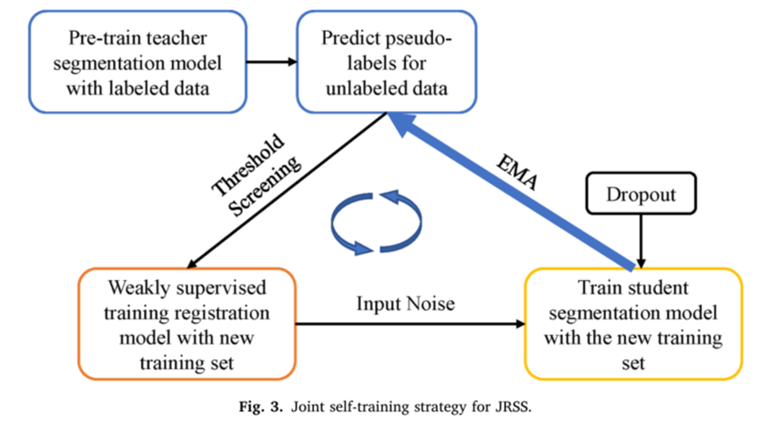
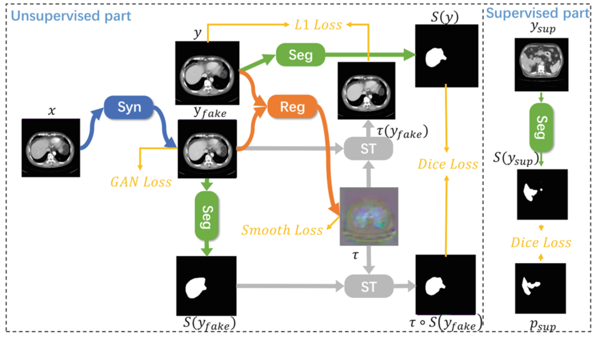
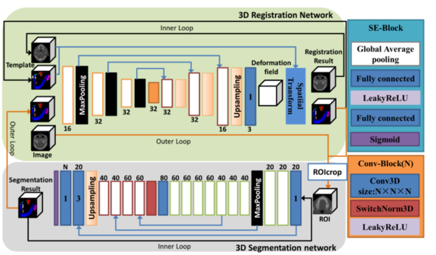
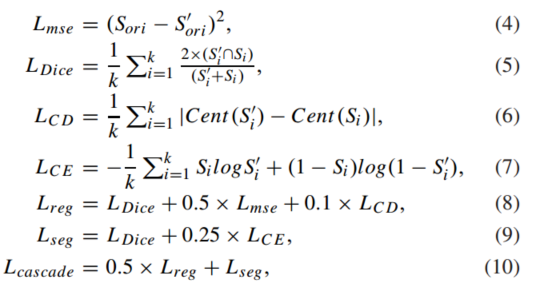
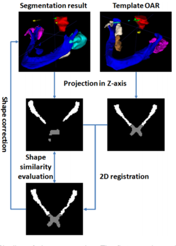
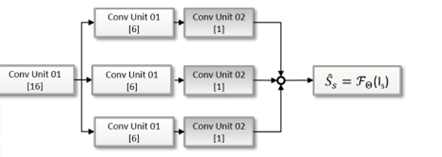
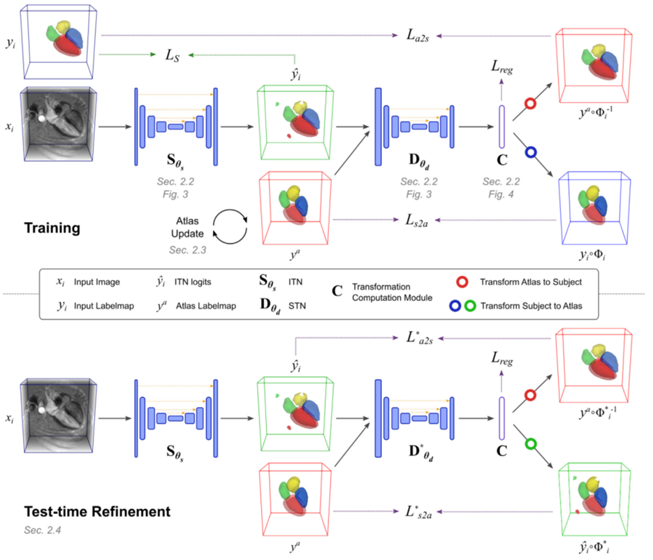
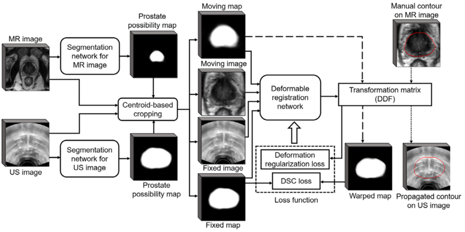
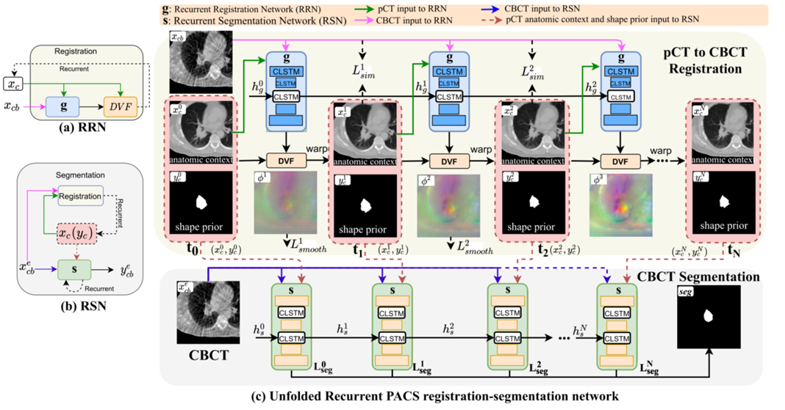
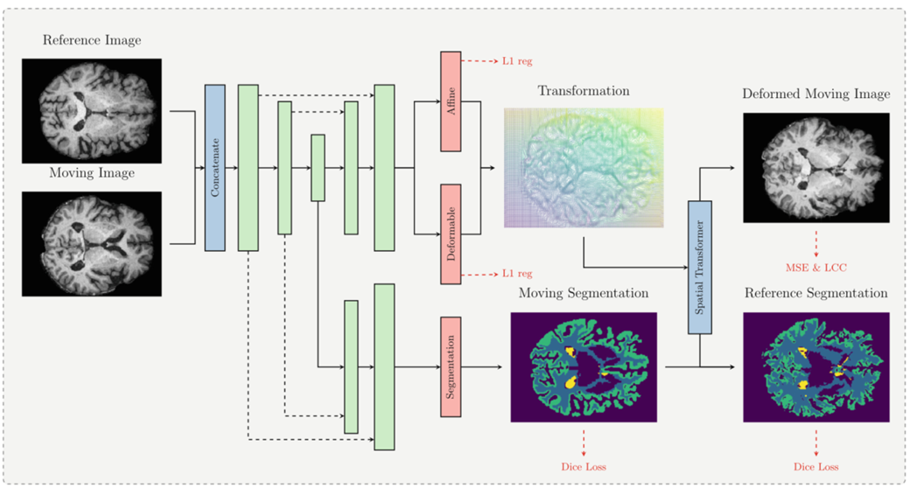

## 目录

[TOC]

### 1. VoxelMorph: A Learning Framework for Deformable Medical Image Registration (2019 CVPR VoxeMorph)

1. 方法

   

   - 使用U-net得到flow field,然后使用spatial transformer得到配准图像；
   - ncc loss和梯度平滑loss；
   - 有分割图像作为辅助信息，计算分割图像配准前后的dice作为总loss的一部分。

2. 代码

   - 生成flow field的网络的最后一层使用0均值，1e-5方差的正态分布初始化参数。

     ```python
     self.flow.weight = nn.Parameter(Normal(0, 1e-5).sample(self.flow.weight.shape))
     self.flow.bias = nn.Parameter(torch.zeros(self.flow.bias.shape))
     ```

   - flow field和标准网格相加然后再归一化到（-0.1,0.1）。

     ```python
     def forward(self, src, flow):
         # new locations
         new_locs = self.grid + flow
         shape = flow.shape[2:]
     
         # need to normalize grid values to [-1, 1] for resampler
         for i in range(len(shape)):
             new_locs[:, i, ...] = 2 * (new_locs[:, i, ...] / (shape[i] - 1) - 0.5)
     
         # move channels dim to last position
         # also not sure why, but the channels need to be reversed
         if len(shape) == 2:
             new_locs = new_locs.permute(0, 2, 3, 1)
             new_locs = new_locs[..., [1, 0]]
         elif len(shape) == 3:
             new_locs = new_locs.permute(0, 2, 3, 4, 1)
             new_locs = new_locs[..., [2, 1, 0]]
     
         return nnf.grid_sample(src, new_locs, align_corners=True, mode=self.mode)
     ```

   - 医学图像处理包 nibabel

3. 问题：

   代码VoxelMorph-torch/Model/model.py/forward()中new_locs = new_locs[..., [2, 1, 0]],为什么要交换x,y,z的位置。
   
   已解决：在discuss.pytorch.org上有一个关于torch.nn.functional.grid_sample(input, grid)的[讨论](https://discuss.pytorch.org/t/surprising-convention-for-grid-sample-coordinates/79997)。总结以下两点：
   
   1. grid_sample参数每个值的范围是[-1,1] （normalize）。对于2维坐标系统，[-1,-1]表示图像（张量）左上角的像素点坐标，[1,1]表示图像（张量）右下角的像素坐标。
   
   2. grid_sample采样了相机坐标系统。对于2维图像（张量），左上角是原点，x轴是沿着宽度的方向（即张量的第二个维度），y轴沿着高度方向（即张量的第一个维度），这与张量的索引位置相反。例如，grid=[1,-1]，采样的是input右上角位置的像素，直觉上容易错误地认为是采用Input左下角的位置。再例如，下面这段代码会输出a的同一位置的值。总之，grid的维度位置与input的维度位置是相反的，使用的时候需要考虑是否先对grid的维度位置进行调换。
   
      ```python
      a = torch.rand(1, 1, 4, 3)
      b = torch.nn.functional.grid_sample(input=a, grid=torch.tensor([[[[1, -1]]]]))
      # b corresponds to top right corner, i.e. j,i coordinates
      print(a[0, 0, 0, 2], b)
      ```
   
      

### 2. A coarse-to-fine deformable transformation framework for unsupervised multi-contrast MR image registration with dual consistency constraint (2020 TMI)

1. 动机

   - 先叙述了多对比图像和多对比图像分析的意义，然后指出了传统的多对比分析方法的缺点，最后直接说提出了这个框架。

2. 方法

   

   - 先使用一个网络输出仿射变换参数进行仿射变换，然后使用Unet结构输出flow field，然后进行配准操作。

   - 创新点：逆变换场，和两个损失函数。

     - 提出JL loss，即除了similarity（这里是MI）term之外对于图像background的配准结果计算MSE，抑制warped image中处于fixed image background区域中出现object （作者基于磁共振背景的灰度信号接近于0提出了背景抑制损失函数，该函数将f中灰度值小于某个值γ（由数据集据统计得到）的部分特别额外做一个MSE运算（其实也就是相当于让配准后图像对应位置也应该是0）。

       

     - 双重一致性损失：变形配准后的图像经过逆变换后和配准前的图像进行MSE或NCC的损失。

   - 总loss等于上述两项loss加上梯度平滑loss（下图）：

     

3. 代码

   有，没看完。对于形变场中的一个点（位移向量），如果它的雅克比行列式小于0，则表示该点发生了折叠（folding），代码如下：

   ```python
   def jacobian_determinant(disp):
       """
       jacobian determinant of a displacement field.
       NB: to compute the spatial gradients, we use np.gradient.
       Parameters:
           disp: 2D or 3D displacement field of size [*vol_shape, nb_dims],
                 where vol_shape is of len nb_dims
       Returns:
           jacobian determinant
       """
   
       # check inputs
       volshape = disp.shape[:-1]
       nb_dims = len(volshape)
       assert len(volshape) in (2, 3), 'flow has to be 2D or 3D'
   
       # compute grid
       grid_lst = nd.volsize2ndgrid(volshape)
       grid = np.stack(grid_lst, len(volshape))
   
       # compute gradients
       J = np.gradient(disp + grid)
   
       # 3D glow
       if nb_dims == 3:
           dx = J[0]
           dy = J[1]
           dz = J[2]
   
           # compute jacobian components
           Jdet0 = dx[..., 0] * (dy[..., 1] * dz[..., 2] - dy[..., 2] * dz[..., 1])
           Jdet1 = dx[..., 1] * (dy[..., 0] * dz[..., 2] - dy[..., 2] * dz[..., 0])
           Jdet2 = dx[..., 2] * (dy[..., 0] * dz[..., 1] - dy[..., 1] * dz[..., 0])
   
           return Jdet0 - Jdet1 + Jdet2
   
       else:  # must be 2
           dfdx = J[0]
           dfdy = J[1]
           return dfdx[..., 0] * dfdy[..., 1] - dfdy[..., 0] * dfdx[..., 1]
   ```

   

4. 问题

   逆形变场的理解。

### 3. A deep learning framework for unsupervised affine and deformable image registration （2019 Medical Image Analysis DLIR）

1. 动机

   作者列举出了一些基于深度学习的方法，指出了这些方法虽然显示了准确的配准性能，但这些方法都是有监督的，即它们依赖于示例配准进行训练或需要手动分割。然后，又叙述了无监督DL方法已经用于光流估计领域。最后作者直接说明了提出了一种深度学习图像配准（DLIR）框架：一种无监督技术，用于训练CNN进行医学图像配准任务。

2. 方法

   

   

   - 仿射变换网络输出12个仿射变换参数：三个平移，三个旋转，三个缩放和三个剪切参数；

   - 按顺序训练，每个阶段都为其特定的注册任务进行训练，同时保持前几个阶段的权重固定；

   - ncc loss和bending energy penalty loss:

     

3. 代码

   无

4. 问题

   ~~不能理解bending energy penalty loss。~~
   
   bending energy penalty loss：
   
   
   
   它惩罚急剧弯曲的变形，是作用于位移场的二阶导数。

### 4. Attention for Image Registration (AiR): an unsupervised Transformer approach  (2021 arxiv AiR)

1. 动机

   - Transformer在各个领域展示出了强大的能力，本文试图将Transformer模型引入图像配准领域，提出的框架是第一个基于Transformer的图像配准方法。

2. 方法

   

   

   

   - 将配准视为翻译任务，输入移动图像和固定图像，经过一个一个Transformer输出形变场。具体来说，AiR将固定图像分成一些patch序列，输入到Encoder中；将移动图像分成一些patch序列输入到Decoder中，Transformer整体结构不变，最后输出形变场，经过一个STN网络得到配准图像。
   - 提出了一种多尺度注意力并行Transformer(MAPT)，它可以从不同的感知尺度学习特征。MAPT由N个Transformer（N个解码器和N个编码器）组成。对于每个变压器，他们采用不同大小的patch作为输入，生成N个不同的注意力特征图$F_N$ 。然后将N个特征图采样成统一的大小，并按归一化加权比例相加，得到最终的可变形特征图$F$。感觉这个部分论文中没有讲清楚。
   - 实验有点少，说服力也不够强。

3. 代码

   给出了链接，但无法正常访问。

4. 问题

   无

### 5. BIRNet: Brain image registration using dual-supervised fully convolutional networks (2018 MIA BIRNet)

1. 动机

   - 与基于深度学习的配准方法相比，文章旨在解决缺少理想groundtrue形变场（有形变场，但不理想）的问题，进而进一步提高配准精度。用其他方法获得的形变场辅助配准的方法。groundtrue形变场用于快速粗配准，图像相似性损失用于细配准。

2. 方法

   

   - motivation: 

   - point:

     1. Hierarchical dual-supervision双重监督策略：预测变形场与现有groudtrue变形场之间的差异  *$loss_\phi$* ，从groudtrue形变场中抽取出$24^3,14^3,9^3$三种分辨率的patch  (方法如下图), 与 U-net对应各层输出的形变场计算loss，将它们相加得到 *$loss_\phi$；配准图像与固定图像的差异*$loss_M$* 。

        

     2. Gap filling：为了提高预测精度，在u型末端之间进一步插入额外的卷积层来连接低级特征和高级特征，即图中绿色部分。

     3. Multi-channel inputs: 差分图和梯度图也被用作网络的输入，与原图像进行拼接。

   - 从图像中抽取出64\*64\*64的patch作为输入，输出24\*24\*24 patch大小的形变场，对应输入patch的中心区域。在对整个图像进行训练或应用网络时，提取重叠的patch，步长为24，即输出patch大小。这样，所有不重叠的输出patch就可以形成整个形变场。

3. 代码

   无

4. 问题

   ~~差分图和梯度图的理解和计算。~~

### 6. End-to-End Unsupervised Deformable Image Registration with a Convolutional Neural Network (2017 DLMIA&ML-CDS&MICCAI DIRNet)


1. 动机

   以前的方法中要么是传统的方法，要么是有监督的深度学习配准方法，作者提出了第一个无监督端到端的可形变的深度学习配准方法。

2. 方法

   

   - ConvNet regressor是一个由Conv,Pool,BatchNorm组成的普通的神经网络，输出每个像素点在x和y方向的位移大小，然后经过一个STN网络得到配准图像。

3. 代码

   有，理解

4. 问题

   无

### 7. Inverse-Consistent Deep Networks for Unsupervised Deformable Image Registration (2018 arxiv ICNet)

1. 动机

   

   - 现有的大多数算法仅利用空间平滑惩罚来约束变换，这不能完全避免配准映射中的折叠（通常指示错误）。如果使用较大的权值作为平滑约束，过度鼓励待估计流动的局部平滑，如上图（a）所示，获得的配准结果会有全局错误。如果如果使用较小的权值作为平滑约束，学习到的流中会出现大量的折叠，如图（b）所示，从而由于局部缺陷而产生错误配准。如何适当地调整平滑度约束的贡献，同时避免估计流量中的折叠，并保持较高的配准精度是很有挑战性。
   - 以往的研究通常独立地估计从图像A到图像B或从图像B到图像A的变换，因此不能保证这些变换是彼此的逆映射，即忽略了一对图像之间转换的固有逆一致特性。

2. 方法

   

   - 为了解决这两个问题，本文提出了一种逆一致深度神经网络（ICNet）用于无监督变形图像配准。上图中两个Fully Convolutional Network实际上是同一个Network。（a）中绿色部分的是$L_{sim}$， 灰色部分是$L_{smo}$，橙色部分是$L_{ant}$，蓝色部分是$L_{inv}$。 $F_{AB}$ 是将图像A配准到图像B的形变场。 $\widetilde{F}_{BA}$是通过Inverse Network得到的形变场。  在Inverse Network中，相当于把$-F_{AB}$当做图像，用$F_{AB}$对$-F_{AB}$进行采样。

   - 提出了一种反向一致约束$L_{inv}$，以鼓励一对图像在多次传递中相互对称变形，直到双向变形的图像被匹配以实现正确的配准。

     

   - 提出了一个反折叠约束$L_{ant}$，以避免形变场发生折叠。

     

     解释：以下图为例，$i$表示其中一个坐标轴方向（x，y或z），$m+1$是$m$在$i$方向的相邻点，$F_{AB}^i(m)$是作用在点$m$的$i$方向上的位移，$m+F_{AB}^i(m)$表示点$m$位移后的位置，其它符合类似。为了避免发生折叠，点$m$和点$m+1$位移后形成的新的两个点应满足：
     $$
     m+F_{AB}^i(m)<m+1+F_{AB}^i(m+1)\quad\quad \Rightarrow\quad\quad F_{AB}^i(m+1)-F_{AB}^i(m)+1>0
     $$
     点$m$在$i$方向上的梯度定义为：
     $$
     \begin{aligned}\nabla{F_{AB}^i(m)}  & = \frac{F_{AB}^i(m+1)-F_{AB}^i(m)}{(m+1)-m}\quad \\&=F_{AB}^i(m+1)-F_{AB}^i(m) \end{aligned} \tag{2}
     $$
     结合公式（1）和（2）可以得到：
     $$
     \nabla{F_{AB}^i(m)} +1>0 \tag{3}
     $$
     如果公式（3）则表示没有发生折叠，反之，在$m$点发生折叠。

     

   - 总的损失函数$L=L_{smi}+\alpha L_{smo}+\beta L_{inv}+\gamma L_{ant}$ ，其中$L_{smo}=\sum_{p \in \Omega}(\parallel \nabla{F_{AB}(p)} \parallel_2^2+\parallel \nabla{F_{BA}(p)} \parallel_2^2)$，$L_{smi}=(\parallel B-\widetilde A \parallel_F^2+\parallel A-\widetilde B \parallel_F^2$，$\widetilde A$和$\widetilde B$表示分别用用$F_{AB}$和$F_{BA}$配准后的图像。

3. 代码：

   有。只看了损失函数部分，基本理解。

4. 问题

   无

### 8. Learning a Deformable Registration Pyramid (2021 MICCAI)

1. 动机

   提出了一种三维变形图像配准方法，灵感来自PWC-Net，一种流行于计算机视觉的二维光流估计的方法。

2. 方法

   

   - 图（b）中紫色部分表示有可训练参数，白色部分表示没有可训练参数。

   - 四个层级输出四种不同大小的特征图，level 4的特征图最小。$w_f^{(l)}$ 是输入固定图像得到的特征图，$w_m^{(l)}$ 是输入移动图像得到的特征图。从最上面的层开始每一层都要执行图（b）。$U(\phi^{(l+1)})$是上一层得到的形变场，初始值$U(\phi^{(5)})$为全0的张量。**W**表示warp操作，用得到的形变场$U(\phi^{(l+1)})$ warp特征图$w_m^{(l)}$。**A**表示放射变换网络，输入$w_f^{(l)}$和**W**中得到的特征图，输出12个放射变换参数，上图可能少画了$w_f^{(l)}$指向**W**的箭头。**CV**计算运动图像中的扭曲特征图与固定图像中的特征图之间的相关性，输出一个特征图。**D**是一个3D DenseNet, 输入仿射变换后的特征图、CV得到的特征图和$w_f^{(l)}$，输出形变场$ \phi^{(l)}$ 。重复这个过程。

   - 损失函数：

     

3. 代码：

   有，浏览了一部分，不是很理解。

4. 问题：

   **CV**模块的理解和计算没搞清楚。

### 9. Unsupervised 3D End-to-End Medical Image Registration with Volume Tweening Network (2019 JBHI VTN)

1. 动机
   - 受FlowNet 2.0 （一种用在光流估计中的网络）和STN的启发，作者提出了Volume Tweening Network (VTN)，它能够对端到端的CNN进行无监督训练，执行体素级3D医学图像配准。
   - VTN包含了了3个技术组件：（1）级联了注册子网络，这提高了注册大量移位图像的性能，并且没有太大的减速；（2）将仿射配准集成到我们的网络中，这被证明是有效的，比使用单独的工具更快；（3）在训练过程中加入了额外的可逆性损失，从而提高了配准性能。
2. 方法


- 首先用一个FCN回归出12个仿射配准参数进行仿射变换，后面接n个级联的U-Net。黄色部分只向第一个子网络传递梯度，蓝色部分向前两个子网络传播梯度。除了级联多个网络，网络本身没有什么大的创新，提出了Invertibility Loss。

- Orthogonality Loss：对于特定任务（医学图像配准），通常情况下，输入图像只需要小的缩放和旋转就可以仿射对齐。我们想对产生过度非刚性变换的网络进行惩罚。为此，我们引入了$I+A$的非正交性的损失，其中$I$表示单位矩阵，$A$表示仿射配准网络产生的变换矩阵（不包含平移项）。
  $$
  L_{ortho}=-6+\sum_{i=1}^3(\lambda_i^2+\lambda_i^{-2}) \tag{1}
  $$
  其中，$\lambda_{1,2,3}$是$I+A$的奇异值。如果$A$具有很小的缩放和旋转，那么$I+A$将接近与$I$，$I$是正交的。当且仅当一个矩阵的所有奇异值都是1时，它是正交的。因此，$I+A$与正交矩阵的偏差越大(即奇异值偏离1越多)，其正交性损失越大。如果$I+A$是正交的，其值将为0。

- Determinant Loss：假设图像具有相同的手性，因此，不允许包含反射的仿射变换。这就要求 $det(I+A)>0$。结合正交性要求，设行列式损失为：
  $$
  L_{det}=(-1+det(A+I))^2
  $$
  因为正交矩阵行列式为正负1，当行列式为-1时代表A存在反射变换？这时$L_{det}$比较大。当$I+A$不存在反射变换且满足正交性时$L_{det}$接近0，否则会变大。

- Invertibility Loss：不理解

  

  其中，$f_{12}\star f_{21}=f_{21}+warp(f_{12},f_{21})$。

3. 代码
    无

4. 问题

   Determinant Loss和Invertibility Loss不理解。没有明白网络的训练过程。

### 10. Recursive Cascaded Networks for Unsupervised Medical Image Registration (2019 ICCV)

1. 动机

   - 一些研究也试图叠加多个网络。它们以非递归的方式为每个级联分配不同的任务和输入，并逐个训练它们，但它们的性能在只有少数（不超过3个）级联时接近极限。另一方面，级联在处理不连续和闭塞时可能没有多大帮助。因此，根据直觉，作者认为具有递归架构的级联网络适合可变形配准的设置。
   - 然而，大多数提出的网络被强制进行简单的预测，这被证明是处理复杂变形时的负担，特别是大位移。DLIR和VTN也堆叠它们的网络，尽管它们都局限于少量的级联。DLIR一个接一个地训练每个级联，即在固定前级联的权重之后。VTN联合训练级联，而所有连续扭曲的图像都通过与固定图像的相似度来衡量。这两种训练方法都不允许中间级联逐步注册一对图像。这些非合作级联不考虑其他级联的存在而学习自己的目标，因此即使进行更多的级联，也很难实现进一步的改进。
   - 级联方法已经涉及到计算机视觉的各个领域，例如级联分类器逐步改进了从监督训练数据中学习到的姿态估计，加快了目标检测的过程。
   - 因此，作者提出递归级联体系结构，它鼓励对可以在现有基础网络上构建的无限数量的级联进行无监督训练，以提高技术水平。我们的体系结构与现有级联方法的不同之处在于，我们的每个级联通常将当前扭曲图像和固定图像作为输入，并且仅在最终扭曲图像上测量相似性（与DLIR，VTN相反），使所有级联能够协同学习渐进对齐。

2. 方法

   

   - 最终的预测可以被认为是递归预测的流场的组合，而每个级联只需要学习一个简单的小位移对齐，可以通过更深的递归来细化，如下图所示。

     

   - 每一个子网络都是类U-net网络。

   - 在递归过程中可以重复应用一个级联，也就是说，多个级联可以使用相同的参数共享，这被称为共享权重级联。在每个级联之后立即插入一个或多个共享权重级联，即通过将每个$f_k$替换为$n$倍的$f_k$来构造总共$r*n$级联。这种方法在实验中被证明是有效的。当输出流场的质量可以通过进一步细化来提高时，测试过程中的共享权重级联是一种选择。然而，z作者注意到这种技术并不总是得到积极的增益，并可能导致过度变形。递归级联只能确保扭曲的运动图像与固定图像之间的相似性不断增加，但如果图像过于完美匹配，聚合流场就会变得不那么自然。在训练中不使用共享权重级联的原因是，在使用的平台（Tensorflow）的梯度反向传播过程中，共享权重级联消耗的GPU内存与非共享权重级联一样大。要训练的级联的数量受到GPU内存的限制，但当数据集足够大以避免过拟合时，如果允许学习不同的参数，它们会表现得更好。

   - 理论上，递归级联网络保持图像拓扑，只要每个子形变场都保持。然而，目前提出的方法中，折叠区域是常见的，并且在递归过程中可能会被放大，这给权值共享技术的使用带来了挑战。通过仔细研究正则化项，或设计一个保证可逆性的基本网络，可以减少这个问题。

3. 代码

   有，没看

4. 问题

   无

### 11. Affine Medical Image Registration with Coarse-to-Fine Vision Transformer (2022 CVPR C2FViT)

1. 动机
   - 现有的基于CNN的仿射配准方法要么关注输入的局部错位，要么关注输入的全局方向和位置来预测仿射变换矩阵，对空间初始化敏感，脱离训练数据集的泛化能力有限。
   - 在综合图像配准框架中，目标图像对通常在使用可变形(非刚性)配准之前基于刚性或仿射变换进行预对齐，消除了目标图像对之间可能的线性和大空间错位。
   - 最近基于学习的变形图像配准方法的成功很大程度上是通过使用传统图像配准方法进行精确的仿射初始化，传统的配准方法具有较好的配准性能，但配准时间取决于输入图像之间的不对齐程度，对于高分辨率的3D图像体积，配准时间较长。
   - 最近的一项研究[1]表明，**纯CNN编码器在一个看似微不足道的坐标变换问题中失败得很明显**，这意味着纯CNN编码器可能不是一个理想的架构，用于编码笛卡尔空间中图像扫描的方向和绝对位置或仿射参数。[2]还报告了基于CNN的仿射配准方法在实践中表现不佳，即使是对于具有较大接受野的深度CNN。
   - 受到最近Vision Transformer模型成功的激励，作者脱离了现有的基于cnn的方法，提出了一种用于3D医学仿射注册的粗到细视觉转换器(C2FViT)。这是第一个基于学习的仿射配准方法，在学习三维医学图像配准的全局仿射配准时考虑输入图像之间的非局部依赖性。
   - 主要贡献：（1）定量研究和分析了现有基于学习的仿射配准方法和传统仿射配准方法在三维大脑配准中的配准性能、鲁棒性和泛化性。（2）提出了一种新的基于学习的仿射配准算法，即C2FViT，该算法利用卷积视觉转换器和多分辨率策略。C2FViT优于最近的基于CNN的仿射配准方法，同时在数据集上表现出优越的鲁棒性和泛化性; （3）所提出的学习范式和目标函数可以适应各种参数配准方法。
   
2. 方法

   

   

   

   from https://blog.csdn.net/fanre/article/details/124971244

   - 图中，$F_1,F_2,F_3$分别表示不同分辨率大小的固定图像。 

3. 代码

   有，没看

4. 问题

   CoM的理解

- [1] Rosanne Liu, Joel Lehman, Piero Molino, Felipe Petroski Such, Eric Frank, Alex Sergeev, and Jason Y osinski. Anintriguing failing of convolutional neural networks and the coordconv solution. arXiv preprint arXiv:1807.03247, 2018.
- [2] Zhengyang Shen, Xu Han, Zhenlin Xu, and Marc Niethammer. Networks for joint affine and non-parametric image registration. In Proceedings of the IEEE/CVF Conference on Computer Vision and Pattern Recognition, pages 4224–4233, 2019. 1, 2.

### 12. Pyramid Vision Transformer A Versatile Backbone for Dense Prediction without Convolutions (2021 ICCV PVT)

1. 动机

   - 旨在探索一种超越CNN的替代骨干网，可用于密集预测任务，如目标检测和分割等。
   - 虽然ViT适用于图像分类，但直接将其应用于像素级的密集预测，如物体检测和分割，具有挑战性，因为（1）它的输出特征图是single-scale和低分辨率的，（2）它的计算和内存成本相对较高。
   - 为了解决上述限制，这项工作提出了一个纯Transformer骨干网，称为 Pyramid Vision Transformer （PVT），它可以在许多下游任务中作为CNN骨干网的替代方案，包括图像级预测和像素级密集预测。具体而言，PVT克服了传统Transformer的困难：（1）将细粒度图像补丁（即每个补丁4×4像素）作为输入来学习高分辨率表示，这对于密集预测任务是必不可少的；（2）引入渐进式收缩金字塔，随着网络的深入减少Transformer的序列长度，显著降低计算成本；（3）采用空间约简注意（space -reduction attention, SRA）层，进一步减少学习高分辨率特征时的资源消耗。

2. 方法

   

   - PVT采用逐级收缩策略通过patch embedding控制特征图的尺度。

   - PVT为了进一步减少计算量，将常规的multi-head attention (MHA) 用spatial-reduction attention (SRA)来替换。SRA的核心是减少attention层的key和value对的数量，常规的MHA在attention层计算时key和value对的数量为sequence的长度，但是SRA将其降低为原来的$1/2$。SRA的具体结构如下所示：

     

     输入$x \in \mathbb{R}^{(H_iW_i)*C_i}$，然后将它reshape到$\frac{H_iW_i}{R_i^2}*{R_i^2}C_i$，然后再经过一个线性投影$W_S\in \mathbb R^{(R_i^2C_i)*C_i} $, 尺寸就变成了$\frac{(H_iW_i)}{R_i^2}*C_i$，这样$K$和$V$的长度变小了$\frac{1}{R_i^2}$，计算量也就变为了原来的$\frac{1}{R_i^2}$倍。

   - 其他的基本和ViT基本一样。

   - 总体来说，PVT的优点有：

     （1）传统CNN backbone的感受野随着深度增加而逐渐增大，而PVT始终保持全局感受野（受益于Transformer中的自注意力机制，在所有patchs中执行注意力），这对检测、分割任务更为合适；

     （2）相比ViT，引入了金字塔结构的PVT可以嵌入到很多经典的piplines中，如RetinaNet、Mask-RCNN等；

     （3）可以和其他Transformer Decoder结合，组成无卷积的框架，如PVT+DETR进行端到端目标检测。

3. 代码

   有，没看

4. 问题

   无

### 13. TransMorph: Transformer for unsupervised medical image registration (2021 MIA TransMorph)

1. 动机

   - 由于卷积运算的固有局域性（即有限的接受域），卷积网络架构通常在建模图像中显式的远程空间关系(即彼此相距较远的两个体素之间的关系)时存在局限性。U-Net通过在ConvNet中引入向下和向上采样操作来克服这一限制，理论上扩大了ConvNet的接受域，从而鼓励网络考虑图像中点之间的远程关系。然而，仍然存在几个问题：第一，前几层的接受域仍然受到卷积核大小的限制，图像的全局信息只能在网络的较深层查看；其次，研究表明，随着卷积层的加深，来自遥远体素的影响会迅速衰减。因此，在实践中，U-Net的有效感受野比它的理论感受野要小得多。这限制了U-Net感知语义信息和建模点之间长期关系的能力。然而，人们认为理解语义场景信息的能力在应对大变形方面非常重要。

   - Transformer可以是图像配准的一个强有力的候选者，因为它可以更好地理解移动和固定图像之间的空间对应关系。配准是建立这种对应关系的过程，直观地，通过比较运动和固定图像的不同部分。ConvNet的感受野较窄:它在局部进行卷积，其感受野随ConvNet的深度成比例增长；因此，浅层有一个相对较小的感受野，限制了ConvNet将两幅图像之间的远处部分联系起来的能力。例如，如果运动图像的左边部分与固定图像的右边部分相匹配，如果ConvNet不能同时看到这两个部分（即当其中一个部分落在ConvNet的感受野之外），它将无法在这两个部分之间建立适当的空间对应关系。而Transformer由于其较大的感受野和自注意机制，能够处理这种情况，并迅速聚焦到需要变形的部分。

   - 这篇文章的主要贡献如下:

     （1）Transformer-based model：介绍了利用Transformer进行图像配准的开创性工作。提出了一种新的基于transformer的神经网络TransMorph，用于仿射和变形图像配准。

     （2）Architecture analysis：实验证明，位置嵌入是Transformer中常用的元素，对于所提出的Transformer- convnet混合模型来说，位置嵌入是不需要的。其次，实验表明基于transformer的模型具有比ConvNets更大的有效接受场。此外，证明了TransMorph促进一个平坦的配准损失landscape。

     （3）Diffeomorphic registration：证明了TransMorph可以很容易地集成到两个现有的框架中，作为一个注册骨干来提供同胚配准。

     （4）Uncertainty quantification：提供了TransMorph的贝叶斯不确定性变体，产生transformer不确定性和完美校准的appearance不确定性估计。

2. 方法

   

   - 仿射配准网络使用一个Tranformer，回归出旋转、平移、缩放和剪切参数，是一个单独拿出来训练的网络。
   - 下面那个图是Encoder和Decoder详细的结构。

3. 代码

   有，没看

4. 问题

   无

### 14. CycleMorph: Cycle consistent unsupervised deformable image registration (2020 MIA CycleMorph)

1. 动机

   - 现有的深度学习方法在具有配准向量场的变形过程中对原始拓扑结构的保留方面存在一定的局限性。为了解决这个问题，作者提出了一种循环一致的可变形图像配准方法。
   - 另一个重要创新是扩展到多尺度实现，以处理大容量图像配准。

2. 方法

   

   - 配准网络$G_X:(X,Y) \rightarrow \phi_{XY}$，其中$\phi_{XY}$表示从$X$到$Y$的形变场；$G_Y$同理。
   - 图中短虚线和长虚线分别表示移动图像和固定图像。
   - 为了保证变形图像与固定图像之间的拓扑保持，CycleMorph采用了原始运动图像与再变形图像之间的循环一致性约束。也就是说，这两个变形的图像被再次作为网络的输入，通过切换它们的顺序来对图像的像素级施加循环一致性。这种约束源于一个数学观察，即两个拓扑空间之间的同胚映射保留了所有的拓扑性质，但与需要在网络实现方面可微映射的附加条件的微分同胚映射相比，它需要更宽松的约束。由于微分同胚是同胚变形的一个子集，通过保证变形图像的形状连续恢复到原来的形状，使网络具有循环一致性，使网络能够提供能够保持拓扑的同胚映射。

   

   - 在测试阶段，运动图像的连续变形是由局部配准网络控制的，两种配准网络由于每个阶段插补误差的累积而潜在地降低了配准精度。因此，不是对运动图像进行两次变形，而是将训练好的全局和局部网络依次应用于每个尺度上的变形场估计，并且使用细化的变形场仅对运动图像进行一次最终变形。具体来说，给定一对由运动图像和固定图像组成的新输入，经过训练的全局配准网络生成中间变形图像和相应的变形向量场$\phi_{global}$。然后，局部配准网络以变形图像和固定图像中提取的patch为输入，为每个patch生成变形场$\phi_{patch}$。然后，对局部网络生成的变形场进行拼接，并按一定的间隔进行重叠，得到精细尺度上$\phi_{local}$的局部变形场。在这里，为了得到在每个patch的边界处形成合理变形的位移，重叠大小设置为较大。然后，由全局变形域和局部变形域的组合$\phi_{global} \circ \phi_{local}$，得到最终的变形向量域$\phi_{final}$。这种合成方法可以用$\phi_{local}$扭曲$\phi_{global}$，并将结果与$\phi_{local}$相加来实现 [1]。最后，利用$\phi_{final}$和空间变换器对运动图像进行一次变形，使其与固定目标图像对齐。

     [1] Tom Vercauteren, Xavier Pennec, Aymeric Perchant, Nicholas Ayache. Diffeomorphic demons: Efficient non-parametric image registration, NeuroImage, 45 (1), S61-S72 2009.

   

   - 损失函数：$L=L_{regist}(X,Y,G_X)+L_{regist}(Y,X,G_Y)+\alpha L_{cycle}(X,Y,G_X,G_Y)+\beta L_{identity}(X,Y,G_X,G_Y)$
   - $L_{regist}=-(T(X,\phi_{XY})\otimes Y)+\lambda\sum \parallel\nabla\phi_{XY}\parallel^2 $  $\otimes$表示局部归一化互相关操作。
   - 为了保留移动图像和变形图像之间的拓扑结构，在图像的像素级上设计了循环一致性，如图3所示。具体来说，图像$X$首先变形为图像$Y$，之后，变形的图像再次被另一个网络配准，生成图像$\widetilde X$。然后，循环一致性应用于重新变形的图像$\widetilde X$与其原始图像$X$之间，使得$\widetilde X\simeq X$。$L_{cycle}(X,Y,G_X,G_Y)=\parallel T(\widehat Y ,\widehat\phi_{XY})-X\parallel_1+\parallel T(\widehat X ,\widehat\phi_{YX})-Y\parallel_1$。
   - 当通过位移矢量场对图像进行变形时，图像的静止区域不应更改为固定点。考虑到这一点并提高配准精度，如图 3 所示，通过强加输入图像在相同图像用作移动图像和固定图像时不应变形来设计恒等约束。$L_{identity}(X,Y,G_X,G_Y)=-(T(Y,G_X(Y,Y))\otimes Y)+-(T(X,G_Y(X,X))\otimes X)$
   
3. 代码

   有，没看

4. 问题

   无


### 15. ViT-V-Net: Vision Transformer for Unsupervised Volumetric Medical Image Registration (2021 arxiv ViT-V-Net)

1. 动机

   - 尽管卷积网络的性能很有希望，但由于卷积运算的固有局域性，卷积网络架构通常在建模图像中显式的远程空间关系（即彼此相距很远的两个体素之间的关系）时存在局限性。近年来，由于基于自注意力的体系结构在自然语言处理方面的巨大成功。
   - 在这项工作中，作者提出了第一个研究，以调查使用ViT的三维医学图像配准。我们提出了采用混合ConvNet-Transformer架构进行自监督体积图像配准的ViT-V-Net。在该方法中，ViT被应用于移动和固定图像的高级特征，这需要网络学习图像中点之间的远距离关系。编码器和解码器级之间使用长跳接来保持定位信息的流动。

2. 方法

   

   - 在U-Net最下面那层加了一个Vision Transformer。

3. 代码

   有，没看

4. 问题

   无

### 16. Dual-stream pyramid registration network (2020 MICCAI/MIA Dual-PRNet)

1. 动机
   - Lewis等人证明[1]，现有基于CNN的方法的性能在现实世界的临床应用中可能受到限制，其中两个医学图像或体积可能具有显著的空间位移或大的切片空间。
   - 最近的光流估计方法试图通过逐渐细化估计流来处理大位移。这启发作者设计了一种连续warp机制，能够以从粗到细的方式逐步warp两个卷。
   - 除了学习有意义的特征表示外，医学图像配准还需要在移动和固定体积之间具有很强的像素级对应关系，这自然涉及到学习移动和固定体积中间特征之间的局部相关性。目前的光流估计方法利用关联层使网络能够从卷积特征中识别实际对应关系。这也促使作者开发了一种新的3D相关层，能够学习这种相关性，以进一步增强特征表示。
   - 基于CNN的方法可能无法估计复杂变形场中的大位移，最近的工作已致力于通过开发堆叠多网络来解决这一问题，DLIR，CycleMorph, Cursive Cascaded等。然而，多个网络的顺序组合将导致插值伪影（artifacts）的累积，这可能会影响估计变形场的质量。因此，最近的方法试图在多个分辨率下估计变形场。然后介绍了双流编码器和金字塔框架。
   
2. 方法

   

   

   

   - 两个输入图像分别计算两个卷积特征金字塔，生成更强的变形估计深度特征（Figure 2）。

   - 提出顺序金字塔配准，其中配准场序列由一组设计的金字塔配准(PR)模块估计。估计的配准字段在解码层上执行顺序的扭曲，以从粗到细的方式逐渐细化特征金字塔。这使模型具有较强的处理大变形的能力（Figure 1, Figure 3）。

   - PR模块可以通过计算两个特征金字塔之间的局部3D相关性，然后进行多个残差卷积来进一步增强，这些残差卷积聚集了更丰富的解剖结构局部细节，从而更好地估计变形场（Figure 3）。

   - 设计了三维相关层来计算卷积特征空间中两个输入体之间的局部相关性。这使我们能够聚合相关的特征，这些特征在原始PR模块中没有直接探索，但可以在深度表示中强调局部细节。

     

   - 模型生成5个分辨率递增的连续变形字段：$[\Phi_1,\Phi_2,\Phi_3,\Phi_4,\Phi_5]$。。为了计算最终的变形场，将估计的变形场上采样2倍，然后用接下来估计的变形场进行扭曲。这样的上采样和扭曲操作是重复执行的，并依次生成最终变形场（Figure 4），该变形场编码了丰富的多尺度变形多层次背景信息。这允许模型在分层解码层上传播强上下文信息，其中估计的变形场以粗到细的方式逐渐细化，从而聚合高级上下文信息和低级详细特征。高级上下文信息使我们的模型具有处理大规模变形的能力，而精细尺度特征使它能够建模详细的解剖结构信息。

3. 代码

   有，没看

4. 问题

   3D correlation layer 的实现细节没有搞清。

- [1] Lewis, K. M., Balakrishnan, G., Rost, N. S., Guttag, J., Dalca, A. V., 2018. Fast learning-based registration of sparse clinical images. arXiv: 1812.06932 . 

### 17. XMorpher: Full Transformer for Deformable Medical Image Registration via Cross Attention (2022 MICCAI XMorpher)

1. 动机

   

   - 虽然现有的深度网络在单幅图像特征表示方面具有较强的性能，但这些单幅图像网络（single image networks, SINs）在DMIR中对一对图像的特征提取和匹配方面仍然存在局限性：（1）混合区域特征失真的Fusion-first。如图Figure 1(a)所示，一些DMIR方法将运动图像和固定图像进行融合，模拟单幅图像输入条件，并将融合后的图像发送到运动-固定特征的SIN中。但这些方法将特征提取和特征匹配过程混合在一起，导致混合区域的特征失真和弱对齐，从而使网络无法识别图像对之间的一对一对应关系。低效的特征表示能力最终导致了关键结构的缺失和较差的注册细节。（2）带有偏差特征提取的Fusion-last。如Figure 1(b)所示，分别向网络输入运动图像和固定图像，最后融合来自不同网络的特征。但这些网络将特征提取和特征匹配过程绝对分离，导致来自不同SINs的两个有偏差的特征最终匹配，从而使网络忽略了某些区域特征的不同层次（如多尺度）。特征表示的单一性限制了图像之间不同信息的对应关系，最终导致配准效果不佳。
- Transformer的注意机制因其出色的图像相关性捕捉能力而在配准中提供了潜在的应用，但现有的Transformer研究仅集中在单张图像上。在DMIR中，两个图像之间的移动-固定对应关系缺乏相关设计。用于DMIR的Transformer仍然采用与单幅图像任务相同的注意机制，只关注一张图像的相关性，而忽略了图像对之间的对应关系。动态图像与固定图像之间的对应关系捕获能力限制了变压器寻找有效的配准特征进行精细配准。
   - 提出了一种用于双图像输入的新型Transformer——X-shape Morpher（XMorpher），将交叉注意引入到变压器结构中，实现高效、多层次的语义特征融合，有效地提高了配准性能。贡献如下：（1）我们提出了一种新型的全Transformer主干网络。如Figure 1(c)所示，它包括两个并行的特征提取子网络，它们各自的特征以交叉注意的形式进行融合和匹配。通过递进交换网络，通过基于交叉注意的融合模块逐步融合匹配不同图像的特征，从而实现浮动和固定图像对应的有效特征表示，获得细粒度的多层次语义信息进行精细配准。（2）提出了一种新的注意机制，Cross Attention Transformer (CAT) block，用于移动图像和固定图像的一对特征之间的充分通信。CAT块利用注意机制计算相互相关性，从而学习两张图像之间的对应关系，并促进特征在网络中自动匹配。（3）基于DMIR的局部变换将特征匹配过程约束在窗口内，缩小了移动图像与固定图像之间的搜索范围，提高了计算效率，减少了大空间匹配时相似结构的干扰。这种基于窗口的特征通信极大地提高了配准的准确性和效率。
   
2. 方法

   

   - XMorpher利用双U型网络分别提取运动图像和固定图像的特征（图（a）），两个网络通过特征融合模块进行通信，形成X型网络。两个并行网络遵循Unet的编码和解码部分的结构，但用CAT块代替卷积，在两个网络之间的注意特征融合模块中发挥重要作用（图（b））。通过并行通信网络，我们的XMorpher垂直交换交叉图像信息，并在水平上不断细化特征。因此，最终输出的特征具有较强的表达运动图像和固定图像之间对应关系的能力。
   - 来自并行子网络的对应特征$T_m$和$T_f$通过交换输入顺序，通过两个CAT块获得相互关注。然后两个输出与对方的注意力返回到原始pipeline，并为下一个更深入的通信做准备。为了获得足够的相互信息，总共有k次通信。通过两个网络之间的注意特征融合模块，来自不同网络的具有不同语义信息的特征频繁交流，从而不断学习多层次的语义特征，最终进行精细配准。
   - CAT块旨在通过注意机制计算输入特征b到特征s之间具有相应相关性的新特征token（图（b））。b和s分别以不同的方式划分为基窗集$S_{ba}$和搜索窗集$S_{se}$两组窗口，用于下一个窗口的注意力计算。$S_{ba}$和$S_{se}$的大小n（窗口数量）相同，但窗口大小不同。$S_{ba}$中的每个基窗口通过线性层投影到查询集$Q_{ba}$，每个搜索窗口通过线性层投影到$K_{se}$和$V_{se}$。然后，基于窗口的多头注意力（W-MCA）计算两个窗口之间的注意力，并将该注意力添加到基窗口中，使每个基窗口从搜索窗口中获得相应的加权信息。最后，将新的输出集发送到具有GELU非线性映射的2层MLP，以增强学习能力。在每个W-MCA和每个MLP模块之前应用一个LayerNorm （LN）层。
   - 针对变形图像配准主要关注体素局部位移，且移动图像与固定图像之间不存在大跨度对应关系的问题，提出了基于窗口的交叉注意机制，利用多尺寸窗口分区限制窗口内的注意计算。多大小窗口分区包括WP和WAP两种方法，将输入特征令牌b和s划分为不同大小的窗口，如图2（d）所示。基窗口集$S_{ba}$的大小为$n*h*w*d$, $n$是窗口数量。为了获得相同数量的两个窗口集，WAP采用滑动窗口，并将步幅设置为基窗口大小，$S_{se}$的大小为$n*\alpha h*\gamma w*\beta d$。
   - Window-based Multi-head Cross Attention (W-MCA)：$W-MCA(Q_{ba},K_{se},V_{se})=softmax(\frac{Q_{ba}K_{se}^T}{\sqrt {d}})V_{se}$

3. 代码

   有，没看

4. 问题

   无

### 18. Learning Dual Transformer Network for Diffeomorphic Registration (2021 MICCAI)


### 19. DeepAtlas: Joint Semi-supervised Learning of Image Registration and Segmentation (2019 MICCAI)

1. 动机

   ​        图像分割和配准可以相互促进，配准为分割提供了数据增强，分割为配准提供了额外的监督信息并用于评估配准结果。传统的联合分割和配准的方法对单个图像对进行操作而不是图像的总体，并且计算代价高。此外，获得 3D 医学图像的分割标签是困难的和劳动密集型的。因此，大部分 3D 图像数据都没有标签用于有监督学习。针对这样的情况，作者提出了 DeepAtlas，联合学习深度网络进行弱监督配准和半监督分割，贡献如下：

   - 第一个提出了联合学习两个深度神经网络进行图像配准和分割。DeepAtlas 既可以联合训练，也可以单独训练和预测。
   - DeepAtlas 只需要少量的人工分割标签，使用结构相似性损失来相互指导分割和配准。
   - 在极端情况下，如果只有一个手动分割的图像可用，DeepAtlas 有助于 one-shot 分割，同时提高配准性能。

2. 方法

   

   

   ​        弱监督配准学习（蓝色实线部分）：图像相似性损失$L_i$ , 正则化损失$L_r$ 和解剖相似性损失（即分割标签的Dice损失）$L_a$的加权相加来训练配准网络。

   ​		半监督分割学习（黄色虚线部分）：有监督分割损失$L_{sp}$和解剖相似性损失（通过配准网络扭曲的$I_m$的分割标签和$I_f$的分割标签的Dice损失）$L_a$的加权相加来训练分割网络，损失函数定义如下：
   $$
   L_{seg}=\left \{ \begin{matrix} \lambda_aL_a(S_m\circ\Phi^{-1},F_S(I_t))+\lambda_{sp} L_{sp}(F_S(I_m),S_m),&&&if\ I_t\  is\ unlabeled\ ;  \\ \lambda_aL_a(F_S(I_m)\circ\Phi^{-1},S_t)+\lambda_{sp} L_{sp}(F_S(I_t),S_t),&&&if\ I_m\  is\ unlabeled\ ;\\ \lambda_aL_a(S_m\circ\Phi^{-1},S_t)+\lambda_{sp} L_{sp}(F_S(I_m),S_m),&&&if\ I_t\ and\ I_t \ are\ labeled\ ; \\ 0\ , \ \ \ \  if\ both\ I_t\ and \ I_m\ are\ unlabeled \ . \end{matrix}\right. \tag{1}
   $$
   当$I_t$没有手动分割标签时，$L_a$相当于有监督分割损失，其中$S_m\circ\Phi^{-1}$是噪声标签。当$I_m$没有手动分割标签时，通过分割网络获得标签，然后扭曲这个标签并与$S_t$计算Dice损失。当$I_t$和$I_m$都有标签时，$L_a$不监督分割网络，因为此时$L_a$中没有$F_s$，但会监督配准网络。当$I_t$和$I_m$都没有标签时，不训练分割网络。总的来说，$I_m$和$I_t$谁没有手动分割标签，谁就通过分割网络来生成伪标签然后用于半监督训练，最少也要有一个手动分割标签。

   ​         训练时，交替训练两个网络中的一个，同时保持另一个固定。由于分割网络收敛更快，分割和配准网络交替训练步数为 1 : 20。由于从零开始联合训练是很困难的，所以作者首先分别对单个分割、配准网络进行预训练。当真实标签数量极少时，比如只有一个，那么从零开始单独训练分割网络是很难的，所以作者最先使用无监督预训练好配准网络，然后再使用这个配准网络从头训练分割网络。直到分割网络能得到合理的结果后，才开始联合训练（交替训练）。

3. 总结

   ​        作者提出了 DeepAtlas 框架，用于仅使用少量标注图像的分割和配准网络的联合学习。当只给出一个真实分割标签时，作者的方法提供了 one-shot 分割学习，大大提高了配准效果。这表明，一个网络可以受益于对另一个网络提供的无标签数据的不完善监督。DeepAtlas 为训练分割和配准网络时缺少真实分割标签提供了一个通用的解决方案。对于未来的工作，为分割和配准网络引入不确定性措施可能有助于缓解一个网络的不良预测对另一个网络的影响。研究通过层共享的分割和注册网络的多任务学习也将是有益的。这可能会进一步提高性能并减小模型尺寸。

4. 问题

   ​         在实验部分，作者考虑 one-shot 的情况（N = 1，N表示手动分割标签的数量），设计了 Semi-DeepAtlas（Semi-DA）：固定无监督（N = 0）预训练好的配准模型，用于从零训练分割网络（N = 1）。使用Semi-DA分割网络和无监督配准网络初始化DA模型。似乎N=1的时候不足以训练好一个分割网络？没有理解它的one-shot分割过程。

   

### 20. A Cross-Stitch Architecture for Joint Registration and Segmentation in Adaptive Radiotherapy （2020 PMLR）

1. 动机

   ​        医学图像自动轮廓化的两种常用方法是图像分割和基于配准的轮廓传播。在自适应图像引导放射治疗的背景下，基于配准的方法具有使用患者解剖结构的先验知识的优势，并且能够准确deform低对比度结构，这些结构难以用附近高对比度结构进行识别。图像分割有其自身的优势，最显著的是能够准确地勾画出器官的轮廓，这些器官在两次访问之间的形状变化很大。

   ​        为了充分利用这两种方法的独特优势，提出了联合配准与分割（JRS）方法。在这项工作中，作者使用多任务学习领域的概念，通过在架构级合并这两个任务来进一步连接配准和分割，而不仅仅是通过损失函数。

2. 方法

   

   ​       

   ​       作者提出的方法如上图所示。JRS输入固定图像$I_f$，移动图像$I_m$，和$I_m$的分割标签$S_m$。 JRS输出$S_f^{pred}$，并与真实标签$S_f$计算Dice loss；输出形变场$\Phi^{pred}$，并计算它的Bending Energy（$\Phi^{pred}$的二阶导数，即Hessian矩阵）作为正则化loss；用$\Phi^{pred}$扭曲$I_m$得到$I_m^{warped}$, 并与$I_f$计算NCC loss；用$\Phi^{pred}$扭曲$S_m$得到$S_m^{warped}$, 并与$S_f$计算NCC loss，这几部分loss加权相加作为总的loss。图中S表示分割层（一个或多个卷积组成的模块），R表示配准层。Cross-Stitch单元是这些层交换信息的模块[1]。Cross-Stitch的计算过程如下：给定分割网络S第$l$层的第$k$个卷积核得到的特征图$X_S^{l,k}$，配准网络R第$l$层的第$k$个卷积核得到的特征图$X_R^{l,k}$，和四个可学习的参数$\alpha_{SS}^{l,k},\alpha_{SR}^{l,k},\alpha_{RS}^{l,k}$和$\alpha_{RR}^{l,k}$，Cross-Stitch单元计算得到的特征图为：
   $$
   \left[
    \begin{matrix}
   	\hat{X}_S^{l,k}\\
   	\hat{X}_R^{l,k}
     \end{matrix}
     \right]=\left[
    \begin{matrix}
   	\alpha_{SS}^{l,k},\alpha_{SR}^{l,k}\\
   	\alpha_{RS}^{l,k},\alpha_{RR}^{l,k}
     \end{matrix}
     \right]\left[
    \begin{matrix}
   	X_S^{l,k}\\
   	X_R^{l,k}
     \end{matrix}
     \right] \tag{1}
   $$
   Cross-Stitch的优点是能够学习在任务之间共享的特征图，如果这是有益的。相反，如果特征图对完全独立更好，网络可以学习单位矩阵来分离这些特征映射。这允许以一种灵活的方式在两个路径之间共享表示，在参数数量方面的成本可以忽略不计。

   

   [1] Misra I, Shrivastava A, Gupta A, et al. Cross-stitch networks for multi-task learning[C]//Proceedings of the IEEE conference on Computer Vision and Pattern Recognition (CVPR). 2016: 3994-4003.

3. 总结

   ​       在这项工作中，作者提出了从架构上连接图像配准和分割，以生成对自适应图像引导放疗至关重要的日常器官勾画。作者尝试了在三维全卷积神经网络中交织配准和分割的不同方法，发现用Cross-Stitch单元连接任务效果最好。通过Cross-Stitch单元，网络学习在其配准路径和分割路径之间交换信息。未来研究的一个有希望的方向是研究在联合网络中添加第三个任务，特别是放射治疗计划的生成。这可能使联合网络产生具有良好剂量学的特征。进一步的研究可能是针对不同患者群体和扫描仪的网络泛化。

4. 问题

   无

### 21. A Hybrid Deep Learning Framework for Integrated Segmentation and Registration: Evaluation on Longitudinal White Matter Tract Changes (2019 MICCAI)

1. 动机

   ​       在纵向成像研究中，可以使用针对纵向数据定制的方法来提高分割的一致性。现有的解决方案通常涉及独立的配准和分割组件，这些组件在多级管道中按顺序或迭代地执行。利用可变形配准建立的空间对应关系，既可用来引入先验值在后续时间点进行分割，也可用来在公共空间中进行分割。作者在这里提出了一种新的混合卷积神经网络，它可以在单一过程中优化分割和配准。

2. 方法

   

   ​         配准和分割共用一个网络。Hybrid CNN为U-Net。

3. 总结

   有点水

4. 问题

   无

### 22. A segmentation-informed deep learning framework to register dynamic two-dimensional magnetic resonance images of the vocal tract during speech (2022 BSPC)

1. 动机

   ​        动态磁共振(MR)成像可以在讲话过程中可视化发音器。在声道的二维MR图像中量化发音器运动的兴趣越来越大，以更好地理解语音产生，并可能为患者的管理决策提供信息。一些研究使用传统的变形配准方法来估计语音过程中声道的一系列动态2D MR图像中图像之间的位移场，然而，这些研究都没有评估或讨论配准方法是否捕捉到了舌头和软腭接触的变化。这项工作包括两个贡献。首先，它提出了基于分割的深度学习的可变形配准框架，以优化其在语音过程中估计声道动态2D MR图像之间的位移场。其次，这项工作首次使用了基于关节运动（腭咽闭合）的可量化和临床相关方面的度量来评估这些位移场的准确性。

2. 方法

   

   ​        首先，图像对被用作分割网络的输入，分割网络估计图像中六个不同解剖特征的分割。其次，对分割进行后处理，以去除解剖学上不可能的区域（论文中没有细讲）。第三，将图像对和后处理分割用作配准网络的输入，该配准CNN估计位移场以使运动图像与固定图像对齐。第四，将运动图像和位移场作为空间变换器的输入，对运动图像进行变换。在训练和评估过程中，还使用空间变换器对运动图像的ground-truth (GT)分割进行变换。损失函数包括移动图像和固定图像的相似度损失、形变场正则化损失和分割标签的Dice损失，通过损失函数优化整个网络。

3. 总结

   ​         作者开发了一种用于估计语音过程中声道动态2D MR图像之间位移场的框架，并发现该框架比目前五种最先进的可变形配准方法和框架更准确地捕捉发音器运动的各个方面。该框架是朝着这类图像系列中关节运动的全自动量化的最终目标迈出的一步。此外，提出了一种基于发音器运动的临床相关和可量化方面的度量标准，并表明这对于评估语音动态MRI图像的注册框架是有用的。

4. 问题

   无

### 23. Deep Complementary Joint Model for Complex Scene Registration and Few-Shot Segmentation on Medical Images (2020 ECCV)

1. 动机

   

   ​        配准与分割任务具有很强的互补性，在复杂场景和few shot情况下可以相互促进。如上图所示，配准模型在训练过程中为分割模型提供了不同的增强数据（扭曲的图像和标签）或弱监督数据（固定图像和扭曲的标签），从而减少了标签的要求，增强了few shot情况下的分割泛化能力。分割模型对区域约束进行反馈，从而在复杂场景中更加关注感兴趣区域（ROI），实现更精细的配准。**上图中的label应该是移动图像的label，此论文中固定图像应该没有ground true label。**

   ​        然而，由于以下原因，这种互补拓扑的进一步利用受到阻碍：

   - Limitation 1：数据增强能力下降（上图（a））。配准模型在训练过程中，学习匹配真实情况的变形规则，生成不同的扭曲图像作为增强数据，提高分割泛化能力。然而，扭曲图像与固定图像之间的相似度增加并趋于稳定，随着相似度的稳定，扭曲图像的多样性逐渐减少。因此，在配准网络的后期训练阶段，在不同的epoch生成相同的扭曲图像，导致增强数据多样性降低。因此配准模型的数据增强能力下降，限制了分割的进一步增强。
   - Limitation 2：弱监督数据中的错位区域（上图（b））。弱监督数据扩大了标记数据集，并为分割模型提供了额外的监督信息。但是，这些数据中较大的错位区域会产生不正确的优化目标，如果直接使用会扰乱训练过程，导致严重的误分割。
   - Limitation 3：缺乏基于标签的区域约束（上图（c））。然而，在few-shot环境下，由于标签较少，缺乏基于标签的区域约束。因此在复杂场景下，配准模型会进行粗糙优化，复杂的背景会限制在ROI上的配准性能。

   ​       针对这三个问题，作者提出了三个解决方案（第2节叙述）。本文提出了一种深度互补联合模型（Deep Complementary Joint Model, DeepRS），该模型最小化复杂场景下的背景干扰，以实现对ROI的更精细配准，并大大降低了少镜头情况下分割的标签要求，以获得更高的泛化能力。

2. 方法

   

   Solution 1: Deep Structure Sampling (DSS) for Sustainable Data Augmentation. 

   

   ​        DSS块通过在变形场中嵌入随机扰动因子，持续生成不同的增强数据，以增加扭曲图像和标签的不确定性。配准过程是图像结构信息的位移，而形变程度的扰动实现了对该位移路径上的信息采样。因此，DSS块带来两个优势：1）可持续的数据增强。通过扰动因子控制配准网络的变形程度，保证配准网络能够持续生成多样化的增强数据。2）真实分布。从位移路径中提取结构信息，得到的增强数据比其他人工增强方法更符合实际分布。上图 a）对形变场$\phi$乘以从均匀分布中采样得到的扰动因子$\alpha$, 得到采样后的形变场$\hat{\phi}$。因此，即使配准网络已经融合，被它扭曲的图像和变形的标签仍然会有很大的多样性。从图 b）可以看出，随着α的增大，由于其结构信息接近于固定图像，扭曲图像逐渐接近于固定图像。

   Solution 2: Alignment Confidence Map (ACM) for Supervision Information Utilization.

   ​       基于Patch-GAN的像素级鉴别器学习扭曲图像和固定图像之间的相似性，并输出突出显示对齐区域的对齐置信度图。因此，在计算弱监督损失函数时，通过这些对齐置信度图可以抑制不对齐的区域，并利用对齐区域中的监督信息进行更高的分割泛化，如式（1）所示
   $$
   L_{acm}=-D(W(x_m,\hat{\phi}), x_f)\ W(y_m,\hat{\phi})\ logS(x_f) \tag{1}
   $$
   其中，$x_m,y_m,x_f$和$\hat{\phi}$ 分别表示移动图像、移动图像的标签、固定图像和采样的形变场。 $D(\cdot,\cdot)$表示计算两个图像直接的相似度，$W(\cdot,\cdot)$表示扭曲操作。$D(\cdot,\cdot)$计算得到的应该还是一个矩阵，表示对应位置的像素的相似度。$S(x_f)$应该是分割网络输出的软分类标签。$W(y_m,\hat{\phi})和$$S(x_f)$重合（对齐）的区域权重大，对应的相似度损失就越大，误差区域的损失值将得到较低的权重，从而抑制干扰。由于$y_m$是0,1二值化的，不重合的部分权重应该是为0。**这个公式中似乎没有对齐置信度图，即图中的绿色箭头。而且，Limitation 2说的应该是固定图像和扭曲得到的标签的不对齐问题，但这里解决的是输入到配准网络的扭曲标签和分割后的标签不对齐的问题？**

   Solution 3:  Deep-Based Region Constraint (DRC) for Finer Registration on ROIs.

   ​        DRC策略通过来自分割网络的固定和扭曲分割掩码之间的约束（公式（2））来引导注意力在ROI上进行更精细的配准。该深度区域约束以变形图像和固定图像中对应区域的对齐为优化目标，实现了 1）在少镜头情况下释放基于标签的区域约束的标签要求，2）独立优化不同区域以避免相互之间的不对齐，3）在ROI上额外关注区域以实现更精细的配准。
   $$
   L_{drc}=-(S(W(x_m,\hat{\phi}))-S(x_f))^2 \tag{2}
   $$
   即分别在分割网络中输入扭曲的固定图像和固定图像，输出两个分割图像，计算它们的MSE。每个ROI在不同通道中计算，得到独立的精细优化，**而任务不相关区域在一个后台通道中计算（不理解）**。因此，ROI上的精细配准是可用的，并避免了区域间的错误配准。

   ​       DeepRS模型中的配准网络、分割网络和像素级鉴别器通过不同的损失函数组合进行训练，以协调训练过程，实现相互改进。配准网络的损失函数为：
   $$
   L_{reg}=\lambda_{adv}L_{adv}+\lambda_{drc}L_{drc}+\lambda_{cc}L_{cc}+\lambda_RL_{R}
   $$
   其中，像素级鉴别器的对抗损失$L_{adv}$提供了扭曲图像和固定图像之间的相似度度量，分割网络中DRC的损失引起了对ROI的配准关注，$L_{cc}$表示局部互相关损失，$L_R$表示形变场的正则化损失。分割网络的损失函数$L_{seg}$由两部分组成：
   $$
   L_{seg}=\lambda_{acm}L_{acm}+\lambda_{ce}L_{ce}
   $$
   ACM损失$L_{acm}$将弱监督数据加入到训练中，以获得更高的分割泛化能力，扭曲标签和扭曲图像通过分割网络得到的标签之间的交叉熵损失$L_{ce}$来保持正确的优化目标。鉴别器由参考图像$x_r$和固定图像$x_f$组成的配准图像对作为阳性情况，由扭曲图像$x_w$和固定图像$x_f$组成的图像对作为阴性情况。参考图像$x_r$是运动图像$x_m$和固定图像$x_f$的融合，$x_r=\beta*x_m+(1-\beta*x_f)$。鉴别器的损失除了$L_{adv}$外，还有鉴别真假固定图像的损失$L_D$
   $$
   L_D=-log(D(x_r,x_f))-log(1-D(x_w,x_f))
   $$

3. 总结

   ​       本文提出了一种用于复杂场景配准和少镜头分割的深度互补联合模型（DeepRS）。本文提出的DSS块通过扰动因子随机调整变形场，从而提高了扭曲图像和标签的活性，实现了可持续的数据增强能力；提出的ACM方法通过像素级鉴别器的对齐置信度映射有效地利用弱监督数据中的监督信息，带来更高的分割泛化；提出的DRC策略从分割模型中构建了扭曲和固定图像之间的无标签损失，从而在ROI上实现更精细的配准。本文的工作大大降低了对大型标记数据集的要求，并提供了精细的优化目标，从而提高了配准和分割精度，大大节省了成本。特别是，我们的DeepRS模型在一些标记困难、场景复杂或数据集小的情况下具有很大的潜力。

4. 问题

   第2节加粗部分。

### 24. Deep Learning-Based Concurrent Brain Registration and Tumor Segmentation (2019 Frontiers in Computational Neuroscience)

1. 方法

   ​        本文中，我们提出了一种基于双重深度学习的架构，同时解决配准和肿瘤分割问题，放松了预测肿瘤区域内的配准约束，同时提供位移场和分割图像。

   

​                 共享编码器，分离解码器结构。

### 25. Image-and-Spatial Transformer Networks for Structure-Guided Image Registration (2019 MICCAI)

1. 动机

   ​        作者认为到目前为止，基于神经网络的图像配准并没有充分利用深度表示学习。同时观察到，无论监督方法还是无监督方法都没有利用神经网络的两个关键优势，即 1）学习为下游任务优化的新表示的能力，以及 2）在训练期间incorporate额外的信息并从中受益的能力，但是这些信息在测试时不可用或很难获得。这种额外的监督（如分割标签和landmark等）可以帮助在测试时以不同于单独使用图像强度的方式指导配准。例如，配准可能专注于特定的Structures-of-Interest (SoI)。然而，目前的方法不能保留或显式提取这些额外的信息，因此不能在测试时进一步使用。

   ​        为了克服这些限制，并充分利用神经网络学习表示的关键能力，引入了图像和空间转换网络（ISTN），其中添加了专用的图像转换网络（ITN）到空间转换网络（STN）的头部，旨在提取和保留有关SoI的信息。ITN产生一种新的图像表示，该图像表示以端到端方式学习，并针对下游配准任务进行优化。这不仅允许我们在测试时预测良好的初始转换，而且允许使用完全相同的模型进行精确的特定于测试的迭代细化，从而实现结构引导配准。

2. 方法

   ​        STN是大多数基于DL的图像配准网络的构建块。STN有两个主要组成部分：使用卷积层学习输入的新表示的特征提取部分，以及将这些表示映射到转换参数的第二部分。然而，STN可以学习的表示形式并不是公开的，而是在推理过程中保持隐藏（可能是指无法直观理解到这些表示的所代表的含义）。作者通过引入专用的图像转换网络，重新设计了基于图像配准的神经网络转换模块的基本构建模块。

   

   
   
   ​      作者将ITN定义为卷积神经网络，将输入图像映射到与$S_M$和$S_F$有相同大小和维度的输出图像$M'$和$F'$。$S_M$和$S_F$分别是固定图像和移动图像的监督信息（如分割图像或landmark等）。然后将$M'$和$F'$输入到STN网络中，输出变换参数$\theta$。图中虚线框里面有两幅图像，$F$, $M$和$S$分别表示固定图像、移动图像和监督图像，下标$\theta$表示对图像进行变换，$L$表示对应两幅图像的相似性损失。有explict和implicit两个损失组合策略，对应的损失项如上图所示。总的来说ITN的作用就是将输入图像变成相应的监督图像，如果监督信息是分割图像，那么ITN就是分割网络，如下图所示，第一行逐渐输出分割标签，第二行逐渐输出landmark。
   
   
   
3. 总结

   ​       ISTN是一种基于神经网络的结构引导图像配准的通用框架，使用学习表示进行特定测试的细化。在SoI信息包含噪声的情况下，隐式学习表示可能有助于防止过拟合。

4. 问题

   ​        作者说ITN的作用是显式地公开学习的图像表示，这对于STN解决的下游配准任务是最优的。但我感觉输入的$M'$和$F'$只包含有监督的那部分信息，似乎不足以产生能够对原始图像进行良好变换的参数。


### 26. Joint few-shot registration and segmentation self-training of 3D  medical images (2022 BSPC)

1. 动机

   ​        在一些联合配准和分割的方法中，当分割用于弱监督配准时，分割伪标签的质量往往被忽略。当使用配准进行分割时，不考虑配准变形对输入的噪声影响。而未标记的数据通常被排除在损失计算之外。其他方法通常需要大量标记数据进行监督训练。

   ​        为了这些局限性，作者提出了一种联合配准和分割自训练框架（JRSS），该框架使用伪标签为分割和配准提供额外的监督学习。要点如下：1）JRSS允许双任务在循环迭代中相互学习和促进，共同提高了3D医学图像在few-shot场景下的多器官分割和变形配准双任务性能。2）JRSS集成了注入噪声、阈值筛选和不确定性估计等多种校正方法，保证了伪标签由粗到细的正向优化。3）质量评估和筛选伪标签促进弱监督配准的学习，配准的数据变形作为输入噪声和数据增强。4）JRSS通过联合自训练逐步增加分割和配准的弱监督训练，实现分割和配准的联合学习和知识互补。

2. Related Work摘要

   ​        基于DL的伪标记策略为标签稀缺的医学图像任务提供了一种利用无标记数据增强模型性能的重要方法。在医学图像配准和分割的双重任务中，分割（伪）标签为与图像强度无关的配准学习提供了额外的弱监督约束。配准在本质上可以为分割提供比随机翻转、缩放和仿射变形更合理的数据增强方案。此外，作者将变形图像视为一种输入噪声。

   ​        最近的联合配准和分割学习（joint registration and segmentation learning, JRS）方法取得了显著的效果。一方面，利用无监督配准或域自适应，将部分标记数据与无标记数据对齐，生成新的符合目标集结构特征的标记训练集，该训练集可以被完全监督进行分割或配准学习。这些方法利用配准进行标签传播，显示了在JRS学习中使用配准进行数据增强的优点。另一方面，使用分割标签可以使配准网络额外关注ROI，约束网络优化，实现更精细的配准。

   ​        作者的JRSS使用了类似[DeepAtlas](19. DeepAtlas: Joint Semi-supervised Learning of Image Registration and Segmentation (2019 MICCAI))， [DeepRS](23. Deep Complementary Joint Model for Complex Scene Registration and Few-Shot Segmentation on Medical Images (2020 ECCV))和RSegNet的模型架构。它们通过联合损失函数和分割伪标签研究了半监督分段和弱监督配准的相互帮助，展示了分割和配准联合学习的优势。而DeepAtlas的分割网络在输入无标签数据时，将Dice loss设为0，这意味着无标签数据不会参与分割网络的优化。DeepRS利用基于GAN的对齐置信度图来测量配准，为弱监督分割提供加权损失。但是，变形场容易受到背景标签的干扰，导致变形失真。RSegNet需要对标记数据进行完全监督的训练，以确保伪标签有利于注册，未标记的数据将不参与训练。另一种JRS方法，[Cross-Stitch](20. A Cross-Stitch Architecture for Joint Registration and Segmentation in Adaptive Radiotherapy （2020 PMLR）)使用名为Cross-Stitch的单元在架构级融合分割和注册的双重任务，但也需要依赖于带有标记数据的监督训练。作者的JRSS采用配准和分割的联合自训练策略，通过伪标签构建双任务的知识桥梁，多种校正方法确保伪标签的良性循环，克服了上述JRS方法的局限性。

   ​        使用伪标签的半监督分割自训练取得了很好的效果，但是模型生成的伪标签仍然会包含有噪声的预测，因此筛选伪标签是一个必不可少的过程，以避免质量较差的伪标签影响模型的迭代训练。JRSS结合了最近的SOTA半监督自训练框架来筛选伪标签，以确保分割网络被很好地学习。

3. 方法

   

   3.1 分割：

   （1）预训练教师网络：第一步用有标签数据预训练教师分割网络，用soft multi-class Dice loss 解决类别不平衡问题。

   （2）伪标签筛选：用训练好的教师分割网络给无标签数据生成软伪标签（不同类别的概率分布），用给定的阈值$\tau$筛选伪标签，将剩下的软伪标签转化为硬伪标签。

   （3）伪标签学习的自动校正：将有标签的数据和伪标签数据混合成新的训练集，在这个训练集上训练学生分割网络，训练时给输入图像加入噪声（dropout）。当使用dropout作为模型噪声时，学生网络被迫模仿一个更强大的集成模型，这保证了自训练中的分割网络会不断进步。此外，对于无标签数据，用预训练得到的配准网络对移动图像进行扭曲可以作为一种输入噪声（相当于给固定图像加入噪声）。损失函数包括$L_c$,$L_u$和$L_d$三部分，$L_c$计算了分割输出和标签（包括真实标签和伪标签）的交叉熵；$L_u$计算了学生网络和教师网络输出的KL散度，在教师模型和学生模型的两个softmax预测之间进行不确定性估计，**以纠正在学生网络学习时的伪标签干扰。（这句话不理解）**

   （4）迭代训练：将学生网络权重的指数移动平均（EMA）作为新的教师分割模型的权重，回到步骤（2）。如下图所示：

   

   3.2 配准：

   ​         对于没有分割标签的图像，使用带有（伪）标签数据的新训练集为配准网络提供弱监督训练。损失函数包括图像相似性损失$L_i$, 正则化损失$L_r$和扭曲的移动标签与固定标签的Dice损失$L_d$。

   3.3 训练

   ​      先对分割模型进行半监督训练，只有当分割网络能够预测出超过初始阈值的伪标签时，联合训练才开始。

4. 总结

   ​       本文提出了一种联合配准和分割自训练框架JRSS，以提高人工注释较少的场景下医学图像配准和分割的双任务性能。通过伪标签的噪声注入和不确定性校正，确保分割网络在自我训练过程中迭代优化。由粗到细训练的分割网络为无标签数据预测出更多符合条件的伪标签，因此基于无监督配准学习，可将无标签数据及其伪标签作为弱监督配准约束加入。配准提供的数据扭曲为分割自训练注入了输入噪声，提供了更合理的数据增强。在未来的工作中，条件图像配准方法结合自监督学习范式可自动搜索最优解。多模态双任务学习也可以通过联合自我训练与对抗性学习域适应相结合进行研究，这可能进一步减少对标记数据的依赖。

5. 问题

   ​        第3节加粗部分。分割和配准如何一起训练好像没有讲。

### 27. Joint Learning of Motion Estimation and Segmentation for Cardiac MR Image Sequences (2018 MICCAI)

1. 动机

   ​       大多数方法认为分割和运动估计是两个独立的问题。然而，这两个任务是密切相关的，学习一个问题的有意义的表示应该有助于学习另一个问题的表示。本文提出了一种联合深度学习网络，用于同时预测心脏MR序列的分割和运动估计。

2. 方法

   

   ​        输入$t$到$t+T$时刻的图像，将$t+1$到$t+T$时刻的源帧图像配准到$t$时刻的目标帧图像。分割网络和配准网络的编码器相同。编码器提取多尺度特征，通过上采样返回原始分辨率并将这些特征图拼接到一起。为了利用连续帧的信息，同时保证估计运动场的时空平滑性，使用了一个简单的RNN，沿着时间维度传播运动信息。通过最小化转换后的帧和目标帧之间的像素均方误差来优化网络。为了保证局部的平滑，使用Huber损失的近似来惩罚流图的梯度。形变场扭曲源帧的分割图像，与目标帧的分割图像计算交叉熵损失。通过最小化训练集上的复合损失函数来联合训练两个分支。

3. 总结

   ​         两个分支共用一个联合特征编码器，可以通过多任务训练进行有效的特征学习，也可以根据时间稀疏注释数据进行弱监督分割。

4. 问题

   无

### 28. A Deep Discontinuity-Preserving Image Registration Network (2021 MICCAI)

1. 动机

   ​        现有的基于dl的配准方法大多通过各种手段将变形场约束为全局平滑连续的。然而，在医学图像配准应用中，这一假设经常被违背，因为组织边界自然是不连续的。这在心脏或腹部成像中尤其明显，包括多种组织类型的大变形，以及组织边界处的器官运动/滑动。不同组织类型物理性质的变异性导致原生组织边界的不连续。因此，强制变形场全局平滑会产生不现实的变形，并导致在这些边界附近的误差增加。

   ​        本文假设所期望的变形场在局部是光滑的，但在组织界面处不同区域/器官之间可能存在不连续。本文为不同感兴趣的区域生成不同的平滑变形场，并组合它们以获得最终的配准场，用于扭曲运动图像。这是第一个将不连续纳入DL网络结构和训练策略的研究，而不仅仅是在损失函数中的自定义正则化项方面。

2. 方法

   

   ​        为了在不同器官/区域的边界处生成局部光滑且不连续的变形场，我们提出针对不同的子区域生成变形场，并将其组合得到最终的变形场。要注册的图像中的子区域必须首先进行手动或自动分割。由于本文的重点是SAX-CMR图像配准，作者将图像分为四个子区域，即LVBP、LVM、RV和background，明确地对心脏边界的不连续进行建模。这些子区域随后被用于训练，并以保持边界不连续的方式注册CMR图像。

   ​       使用四个U-net结构来提取这四个区域的特征（图中的两个点表示U-net），生成每个像素的速度域的均值和方差，从多元高斯分布中采样得到每个像素的位移向量（这个过程叫做scaling and squaring  integration layer，具体过程见Voxelmorpher的微分同胚版本论文）。将四个子区域的形变场组合（相加）得到最终的形变场。为了在保证局部光滑的同时保持各器官/区域界面的不连续，合成变形场没有施加全局光滑约束。不同变形场的组成保留了界面处的不连续，因此只需要保证每个子区域的变形场平滑即可。最终的损失函数为扭曲的图像与固定图像的NCC损失和每个子形变场的正则化损失，还有分割图像的Dice损失，使用损失函数来联合训练整个网络框架。

3. 总结

   无

4. 问题

   无

### 29. Joint segmentation and discontinuity-preserving deformable registration: Application to cardiac cine-MR images (2022 arxiv)

1. 动机

   ​        目前，大多数基于深度学习的配准方法都假设整个图像域的变形场全局平滑且连续，并使用像变形场的L2范数那样的正则化来确保这一点。然而，这一假设并不适用于所有医学图像配准应用，特别是当有物理不连续导致器官/软组织之间的滑动运动时，必须估计输入图像的配准。这篇论文是对[前一篇论文DDIR](28. A Deep Discontinuity-Preserving Image Registration Network (2021 MICCAI))的拓展，在训练和测试过程中，它需要分割掩码将移动和固定的图像分割成相应的解剖区域/结构对，这限制了它在实际场景中的实用性。

   ​        在现有的联合分割配准方法中，分割子网络一般对固定图像和运动图像进行独立分割（或只对运动图像进行分割），而忽略了两者之间存在的内在相关性。为了利用这些相关的结构信息，为了提高联合分割和配准性能，作者在所提出的方法中使用了一个基于“共同注意”的分割子网络来联合分割固定和移动图像。

   ​        本文提出了一种新的保持间断的图像配准方法，该方法确保了全局不连续和局部平滑的变形场，从而导致更准确和真实的配准结果。该方法利用了图像分割和配准的互补性，实现了图像的联合分割和成对配准。在网络的分割组件中提出了一种共同注意块，以学习输入图像中的结构相关性，在网络的配准组件中采用不连续保持配准策略，以确保组织/器官界面处估计变形场的合理性。

   ​        论文在introduction对联合分割和配准、共同注意力和间断保持的图像配准方法进行了详细的分析。

2. 方法

   

   ​        这个方法的主要动机是根据DDIR的要求，改善待配准的图像需要单独分割成不同区域的需求。首先将输入的固定和移动图像输入到分割分支（绿色模块），并预测每个图像的组织/器官特定分割掩码。利用分割掩码将原始的固定图像和运动图像分割为四个不同的图像对，包括LVBP、LVM、RV和背景子区域，掩码内的体素值被保留，而周围区域的体素值被设置为零。随后，每个子区域的固定和运动图像被送入间断保持图像配准分支，输出一个形变场，然后用对应区域的分割掩码提取该区域的子形变场。最后将这些子形变场组合形成最终的形变场，扭曲原始的移动图像。分割和配准分支被端到端联合训练，作为一个单一的网络，使用一个组合的复合损失函数。（图中的一个圈里面一个叉的符号表示用掩码提取图像内特定区域的过程）。配准损失函数为扭曲的图像与固定图像的NCC损失和每个子形变场的正则化损失，还有分割图像的Dice损失。

   
   
   
   
   ​        $F_{fix}$和$F_{mov}$是图中的$y$和$x$。$f,g,h_1$ 和$h_2$是$1*1*1$的卷积。ATT类似于Attention中的A，激活对应位置的特征。分割网络的损失函数为$L_seg=CN(S_{pre}^{mov},S_{gt}^{mov})+CN(S_{pre}^{fix},S_{gt}^{fix})$，其中$CN$表示交叉熵函数。总的损失函数为配准损失函数与分割损失函数的加权和。
   
3. 总结

   ​        虽然所提出的方法被证明可以准确地联合分割和配准输入图像对，优于几种最先进的方法，但一个主要的局限性仍然存在。SDDIR的配准性能高度依赖于分割子网络的性能，即对要配准的输入图像对预测的分割掩码的质量。由于配准子网络需要预测的分割掩码将原始MR图像分割成对对应的区域，当分割掩码质量较差时，配准子网络的性能较差。该领域未来的工作应该着眼于提高不连续保持图像配准方法对医学图像中常见的域移位的鲁棒性。这可以通过向SDDIR注入最新的领域泛化方法来实现，例如，减轻由领域转移(相对于训练数据)导致的分割和注册性能下降。此外，配准质量对SDDIR预测的分割掩模质量的过度依赖可以通过将物体/组织边界建模为弱不连续(与目前SDDIR中使用的强不连续相反)来放松，将其合并到变形场的正则化中，以确保局部平滑和全局不连续的变形场。

4. 问题

   $\sigma(ATT_{mov}*ATT_{mov})$难以直观理解。

### 30. JSSR: A Joint Synthesis, Segmentation, and Registration System for 3D Multi-modal Image Alignment of Large-Scale Pathological CT Scans (2020 ECCV)

1. 动机

   

   <font size=3 color=gray align='center'> 图1： 合成、分割和配准任务之间的关系。在理想的设置中，每个域的空间转换示例及其分割标签都是完全可用的。在更实际的设置中，每个域只有一个可用的示例，每个域都在不同的空间中。 理想情况下的约束可以映射到现实情况下的类似约束。</font>

   ​        合成和分割单独使用时都有局限性，特别是在没有全监督训练数据的情况下，即分别没有配对的多模态图像和分割标签（可能是目标模态的图像和分割标签）。如上图所示，合成、分割和配准任务连接在一起，并定义彼此之间的隐式约束。这促使作者开发了一个满足这些隐含约束的联合合成、分割和配准（JSSR）系统。JSSR由一个生成器、一个分割和一个配准组件，同时执行三个任务。给定一个固定图像和来自不同模态的运动图像进行配准，生成器可以将运动图像合成为相同模态的固定图像，以固定图像为条件，更好地减小域间隙。然后配准组件接受来自生成器的合成图像和固定图像以估计变形场。最后，分割模块估计运动图像、合成和固定图像的分割图。       

   ​       本文提出了一种新的多模态图像配准联合学习方法，该方法结合了合成、配准和分割任务。在训练过程中，每个任务都与其他两个任务相连，提供相互加强的监督信号。

2. 方法

   

   <font size=3 color=gray >图2：JSSR系统。生成器、分割、配准模块和空间变换分别表示为Syn、Seg、Reg和ST。</font>  

   ​      问题描述：给定一个运动图像$x\in X$和一个固定图像$y\in Y$，它们来自不同的模态，但来自同一个病人，目标是找到一个空间变换函数$\tau$以校正两者之间的任何偏差。本文以完全无监督的方式处理这个多模态图像配准问题，以满足常见的应用设置，其中没有任何Ground true变形字段、分割标签或配对的多模态图像可用。如图1所示，图像合成、分割和配准可以通过一组约束联系在一起。基于此，作者开发了一个由三部分组成的系统:生成器$G$、配准模块$\Phi$和分割模块$S$。通过满足图1中的约束条件，可以满足正确配准、分割和图像合成的条件。在优化过程中，这三个任务将相互受益。系统总体框架如图2所示。

   2.1 图像合成

   ​       $G$采用带双输入的GAN，该模型学习一个映射$G:{x,y}\rightarrow \tau^{-1}(y)$。为了方便叙述，假设移动图像$x$来自模态$X$，固定图像$y$来自模态$Y$，$G$需要把在模态$X$中的$x$映射到模态$Y$中的$y_{fake}$，$y_{fake}$与$x$只有模态上的差别。但是在模态$Y$中只有固定图像$y$与$x$相似，所以需要输入$y$，否则模型就不知道任何关于模态$Y$的信息。$y$与$x$不但有模态上的差别，还有形状上的差别（需要用配准消除的那个差别）。$\tau$表示把$y_{fake}$配准到$y$的形变场，$\tau^{-1}$反之，即$\tau^{-1}(y)=y_{fake}$。总$G$就是要把${x}$映射到$y_{fake}$（需要提供$y$），但文中的写法是映射到$\tau^{-1}(y)$。

   ​        GAN的损失函数为：
   $$
   L_{GAN}(G,D)=E_ylogD(y)-E_{x,y}logD(G(x,y)) \tag{1}
   $$
   $y$作为判别器的正样本，$G(x,y)$作为判别器的负样本。在经典的GAN设置中，正样本应该是$\tau^{-1}(y)$，但$\tau^{-1}(y)$是不可用的（因为在模态$Y$中没有与$x$对应的样本$y_{fake}$，即$\tau^{-1}(y)$）。此外还添加了另一个损失项：
   $$
   L_{L_1}^{syn}(G)=E_{x,y}\parallel\tau^{-1}(y)-G(x,y)\parallel_1 \tag{2}
   $$
   **没有$\tau^{-1}(y)$，如何计算这个损失？** 图像合成部分的最终目标是：
   $$
   G^*=arg\ \underset{G}{min}\ \underset{D}{max} \ L_{GAN}(G,D)+L_{L_1}^{syn}(G)  \tag{3}
   $$
   

   2.2 多模态图像配准

   ​      对于两幅图像$x$和$y$，配准模块学习一个函数$\Phi:x,y \rightarrow \tau$，其中$\tau$是一个变形场。首先用合成模型Syn将模态$X$中的移动图像$x$转换为模态$Y$中的图像$G(x,y)$，这样就转变为了单模态图像配准问题。损失函数为：
   $$
   L_{reg}=L_{L_1}^{reg}(\Phi)+L_{smooth}(\Phi)=E_{x,y}\parallel\tau(G(x,y))-y\parallel_1+E_{x,y}\parallel \nabla \tau \ \parallel^2 \tag{4}
   $$
   优化目标为：
   $$
   \Phi^*=arg\ \underset{\Phi}{min} \ L_{L_1}^{reg}(\Phi)+L_{smooth}(\Phi) \tag{5}
   $$
   然而，我们不能在没有$G$的情况下优化这个目标。然而，为了得到一个好的$G$，我们需要一个好的$\Phi$，这是一个难题。一种方法是将两个目标从合成和配准模块优化到一起：

   
   $$
   \tag{6}
   $$
   

   然而，并不能保证我们可以通过最小化$\mathbb{F}(\Phi,G)$来得到最优解。实际上有一个平凡的解可以最小化$\mathbb{F}(\Phi,G)$，即当$G(x,y)=y$并且$\Phi(G(x,y),y)=\Phi(y,y)=I$，即恒等变换。为了缓解这一问题，我们在网络中添加了跳跃连接。**这两句话不理解**。

   2.3 多模态图像分割

   ​        我们执行基于分割的约束有两个原因。首先，分割标签的附加信息可以帮助指导配准过程。但是，本文考虑的是没有分割标签（其实还是用到了一种模态的分割标签）。其次，合成和配准可以有利于分割，这可以帮助在没有分割标签的数据集上开发更好的分割模型。

   ​        我们将分割模型表示为函数$S: x \rightarrow p$，其中$p\in P$表示分割映射域。基于合成、配准和分割任务之间的约束，目标定义为：
   $$
   L_{dice}^{reg}(S,\Phi,G)=E_{x,y}(1-Dice[\ \tau(S(G(x,y))),S(y))] \tag{7}
   $$
   这个损失项将三个组件连接在一起。只有一致性损失，分割模块无法学习到有意义的语义信息。例如，一个预测所有背景的分割模块可以简单地最小化（6）。为了避免这种情况，我们使用完全监督的数据，例如来自公共来源的数据，来正则化分割。重要的是，由于（6）只应用于$Y$域，我们只需要使用来自一种模态的监督数据。因此，监督损失定义为：
   $$
   L_{dice}^{sup}(S)=E_{y_{sup}}(1-Dice[S(y_{sup}),p_{sup}]) \tag{8}
   $$
   其中，$y_{sup}\in Y$和$y\in Y$具有相同的模态，但是两个数据集不重叠，$p_{sup}\in Y$是相应的分割标签。总损失为上述两个损失相加：
   $$
   \mathbb{H}(S,\Phi,G)=L_{dice}^{reg}(S,\Phi,G)+L_{dice}^{sup}(S) \tag{9}
   $$
   2.4 优化策略

   ​         整个系统的最终优化目标是：
   $$
   \Phi^*,G^*,S^*=arg\  \underset{\Phi,G,S}{min} \ \mathbb{F}(\Phi,G)+\lambda_{seg}\mathbb{H}(S,\Phi,G) \tag{10}
   $$
   ​         为了为所有组件提供一个良好的初始点，首先在全监督数据$(y_{sup},p_{sup})$上训练$S$，并在无监督数据上用（6）训练$\Phi$和$G$。最后通过（9）对各模块进行联合优化。在优化（6）和（10）时，我们使用经典的交替策略来训练GAN模型，交替固定$\Phi,G,S$并优化$D$，然后固定$D$并优化其他。

3. 总结

   ​        本文提出了一种新型的多模态图像配准JSSR系统。基于合成、分割和配准任务之间的内在联系，该系统利用了联合学习的优势。该优化可以在多个无监督一致性损失的情况下进行端到端优化，每个组件都受益于联合训练过程。

4. 问题

   ​        第2节加粗部分。

### 31. 3D Lightweight Network for Simultaneous Registration and Segmentation of Organs-at-Risk in CT Images of Head and Neck Cancer (2022 TMI)

1. 动机

   ​       在常规临床实践中，肿瘤医生手动分割危险器官organ-at-risk (OAR) ，这很耗时。此外，由于观察者之间和观察者内部的变化，手动分割引入了不一致性。特别是，OARs范围的确定取决于临床医生的经验和特定的成像方案，特别是对于小体积的软组织。一种准确的 配准方法可以帮助临床医生提高OARs病变定位的准确性。然而，实现这样一个方法是具有挑战性的，主要是由于以下四个原因。1）OAR的解剖结构复杂，变异大。2）CT图像中的软组织，如视神经、视交叉等，对比度较低，难以识别。3）器官的物理尺寸高度不平衡，使得模型难以训练。4）高分辨率CT增加了训练模型的时间。为了克服这些挑战作者提出了一个由配准网络和分割网络组成的级联框架，用于使用CT图像卷对多个OARs进行联合配准和分割。
   
   ​       有研究将OARs定位在CT图像中，得到OARs的ROI，以降低计算成本和所需的GPU内存。然而，这些方法没有将解剖信息作为先验知识，这可能导致分割结果错误。一些深度学习方法将OARs的金标准用于优化配准结果，但是，必须在图像卷上手动划定金标准，这也是费时费力的。针对标签不足的问题，一些人提出了联合配准分割方法，只对部分图像进行标记，建立配准模型，然后利用分割结果优化配准性能。这些方法使用掩码进行损失计算来优化网络，但在特征提取阶段忽略了掩码。与以前的工作不同，本文的方法将配准和分割以迭代和有机的方式结合在一起，两者一起工作，相互补充。在我们的方法的每一次迭代中，掩码都被用作特征提取阶段的地标，以实现更准确的配准。随后，更准确的配准进一步提高了分割性能。
   
   ​        本文的贡献如下：1）提出了一个精确的OARs配准和分割的轻量级框架；2）通过在迭代策略中使用上下文信息，同时提高了配准和分割性能；3）设计了一种可解释的形状校正方法来细化分割结果。
   
2. 方法

   

   <font color=gray size=3> 图1：联合配准和分割框架的pipeline。A：模板选择。B：配准。C：分割。D：形状校正。B部分和C部分的黑色长箭头表示相关阶段的内环，B部分和C部分之间的橙色长箭头表示配准网络和分割网络之间的外环。两个内循环分别显示了使用上下文信息的3D配准网络和3D分割网络中的迭代。外环表示三维配准网络和三维分割网络之间的迭代，相互迭代改进。<font color=green> 图中彩色的图像是分割标签。</font></font>
   
   2.1 模板选择
   
   ​        本文的模板图像就相当于移动图像，似乎模板图像只需要一个，配准到多个目标图像中，一对多的配准。本文使用了一种简单的策略来选择最佳的OARs模板：使用一个患者的整卷图像作为模板，并使用一个传统的配准方法将其配准到其他患者。为了评估配准性能，计算了配准模板与其他患者之间的Dice相似系数（DSC）和均方误差（MSE）。然后，结合DSC和MSE作为差异指数（DI）来评估配准模板与其他患者之间的差异，$DI=(1-DSC)+0.5*MSE$。为所有其他患者配准模板计算每个患者的DI，然后计算平均DI，选取平均DI最低的患者作为最佳模板。
   
   2.2 配准网络和分割网络
   
   
   
   <font size=3 color=gray>图2：配准和分割框架。黑色箭头表示内循环。橙色箭头表示外环。从“分割结果”到分割网络输入的箭头表示内环。将之前的分割结果与图像一起再次输入分割网络，利用上下文信息进行分割。</font>
   
   ​        配准网络采用VoxelMorpher结构，如图2所示。配准网络的输入由目标CT图像体积、模板CT图像体积、模板OAR掩码和目标图像的分割掩码组成。模板CT图像卷是一个选定的要与目标CT图像卷对齐的CT图像卷。模板OAR掩码是模板CT图像卷的手动标记OAR。目标图像OAR掩码由分割网络提供，所以第一次迭代的时候为空。配准网络将模板图像和掩码扭曲，得到配准结果，然后将这个配准结果作为新模板图像和掩码**（这是从图2中观察得到的，但是图1的箭头显示的是将配准结果作为新的目标图像和掩码，这里产生了矛盾？）**，这样不断迭代。
   
   ​        分割网络如图2所示。对于小型OAR的分割，只设置一个上采样层和一个下采样层**（似乎这里论文没讲清楚）**。编码器结构的最后一层输出之后是全局平均池化和全连接层。最后，将softmax作为激活函数，输出ROI类别的分类概率。
   
   2.3 带有迭代上下文更新的级联网络：
   
   ​       本文提出了一个没有训练参数的ROI选择层来连接所提出的配准和分割模块。将配准结果输入ROI选择层，计算OAR的质心。利用质心和有限元法计算了ROI边界**（没明白具体是怎么计算质心和边界的，而且如果这里对图像按照ROI边界进行了裁剪，那么分割结果返回到配准时还应该将掩码图像操作到原始图像大小，但是图中和论文中没写。）**。
   
   ​       在该方法的初始迭代中，配准网络的输入由一个目标CT图像体积、模板CT图像体积、模板OAR掩码和一个空图像体积（所有体素的图像强度均为零）组成，共9个通道。输入空图像体积的原因是我们在第一次迭代中没有初始分割结果。出于同样的原因，分割网络的输入也包含一个空的图像卷掩码**（从图中来看，分割网络第一次迭代的输入应该是目标图像和扭曲的掩码，如果第一次就输入一个空掩码，那分割网络不可能正确训练）**。从第二次迭代开始，将空白图像卷掩码替换为前一次迭代生成的分割概率图。这个过程重复了几次，以迭代地提高配准和分割精度，类似于自动上下文模型。
   
   2.4 损失函数
   
   
   
   其中，$S_{ori}$为模板图像，$S_{ori}^{'}$为配准的模板图像，$S_i$为OAR分割标签的金标准，$S_i^{'}$是配准和分割结果。$Cent(\cdot)$用于计算质心坐标。
   
   2.5 形状校正
   
   
   
   <font color=gray size=3>图3：形状校正pipeline。第一行显示OARs（分割结果或模板）。如第二行所示，自动分割得到的视交叉形状与模板不同。因此，利用二维配准对视交叉位置进行对齐，然后利用形状相似度评价对自动分割结果与模板的视交叉形状进行比较。最后，利用形状校正对分割结果进行光学交叉修正。</font>
   
   ​        对于一些较小的器官，特别是视交叉，即使在较高的DSC下，分割结果有时也不正确，形状修正pileline如图3所示。采用二维传统配准方法将投影模板配准到投影分割结果上。然后，计算二维分割结果与配准的二维模板之间的光学交Hu矩和DSC，并用于评价二维分割结果。当DSC和Hu矩均较高时，分割结果与金标准重叠率较高；但是分割结果的形状是不正确的。因此，我们通过将模板的视交叉乘以分割结果的视交叉来修正形状。当Hu矩较大，DSC较小时，分割结果重叠率较低，形状不正确。然后，我们用配准的模板替换分割结果。**（这段话不理解。）**
   
3. 总结

   ​        本文提出了一种利用CT图像卷中的多视图图像信息的单模型多OAR配准和分割框架。配准网络用于定位新图像卷上的OAR。配准网络用于定位新图像卷上的OAR。根据配准结果，从CT图像卷中生成每个桨叶的ROI。分割网络根据ROI生成分割结果。此外，通过利用上下文信息和迭代策略，配准和分割性能都得到了显著提高。最后，形状校正方法进一步提高了视交叉的分割效果。

4. 问题

   ​        第2节加粗部分。

### 32. Adversarial Optimization for Joint Registration and Segmentation in Prostate CT Radiotherapy (2019 MICCAI)

1. 动机

   ​       图像配准与分割的耦合是在线自适应图像引导放射治疗的一个重要应用。在这个应用中，临床批准的轮廓从最初的规划CT扫描传播到同一患者的日常交叉切片CT扫描。图像配准可用于校正基础器官的形状和位置的解剖学变化，以及补偿患者设置中的任何错位。
   
   ​       本文引入了一种快速的无监督三维GAN来联合进行变形图像的配准和分割。生成器网络估计两幅图像之间的DVF，同时训练鉴别器网络来评估配准和分割的质量，并将反馈传播到生成器网络。我们考虑的用例中，固定和移动图像及其分割可用于训练，这是放射治疗中的常见场景。然而，在测试过程中，DVF估计不需要分割。本文有以下贡献。首先，我们提出了一个端到端的3D网络架构，该网络架构以对抗方式训练，用于联合图像配准和分割。其次，我们提出了一种生成对齐良好的对来训练鉴别器网络的策略。
   
2. 方法

   

   ​      <font color=gray size=3>图1：所提出的生成器（上）和鉴别器（下）网络。</font>

   ​          本文建议训练一个包含两个CNN的GAN：一个生成器网络，预测给定$I_f$和$I_m$的位移场DVF $\Phi$，以及一个判别器网络，评估固定图像$I_f(x)$和扭曲的移动图像$I_m(\Phi(x))$的对齐以及固定图像分割标签$S_f(x)$和扭曲的移动图像分割标签$S_m(\Phi(x))$之间的重叠。生成器输入固定图像和移动图像的组合，输出位移场DVF，判别器输入固定图像、移动图像和相应的分割标签。鉴别器网络使用PatchGAN进行训练。因此，该网络可以量化局部patch的质量，而不是用单个数字表示整个patch的质量。

   ​          生成器和鉴别器的损失函数为：
   $$
   L_{G}^{GAN}=-E[D(I_f(x),I_m(\Phi(x)),S_m(\Phi(x)))]\\
   L_{D}^{GAN}=E[D(I_f(x),I_m(\Phi(x)),S_m(\Phi(x)))]-[D(I_f,\Theta(I_f),S_f)] \tag{1}
   $$
   其中，G和$D$分别表示生成器网络和鉴别器。鉴别器被训练以区分真实和假样本。在这种情况下，假样本是三元组$(I_f,I_m(\Phi),S_m(\Phi))$，而真实样本应该是对齐良好的图像。由于这是无监督配准，并不知道两张图像的理想对齐，我们基于固定图像及其分割单独合成这样的图像：$(I_f,\Theta(I_f),S_f)$，其中$\Theta$是一些随机扰动的组合，用这种合成的图像作为真样本。作者发现，仅使用WGAN损失训练网络，会导致缓慢的收敛和次优配准。因此，在生成器中添加一个基于图像相似度和分割重叠的相似损失$L_{sim}$：
   $$
   L_{sim}=(1-DSC(S_m(\Phi(x)),S_f(x)))+(1-NCC(I_m(\Phi(x)),I_f(x))) \tag{2}
   $$
   将DSC添加到$L_{sim}$中可以确保配准改善了分割，反之亦然。此外，为保证DVF的平滑连续，将DVF的 bending energy penalty $L_{smooth}$作为正则项加入到生成器总损失中，定义为：
   $$
   L_G=L_{sim}+\lambda_1L_{smooth}+\lambda_2L_G^{GAN}
   $$
   
3. 总结

   ​       本文们研究了端到端联合配准和分割网络在自适应图像引导放疗中的性能。与传统的配准方法不同，我们的网络对联合图像配准和分割的最相关特征进行编码和学习，并在未分割的未见图像上利用组合知识。结果表明，在训练过程中，将分割掩码作为鉴别器的输入有明显的好处。这项工作表明，对抗性反馈可以帮助改善配准，即鉴别器可以学习图像对齐的度量。这是一个很有前途的方面，可以在未来的工作中进一步探索。这将包括改进的GAN目标，例如使用梯度惩罚正则化。

   ​      标题虽然提到联合配准和分割，但并不涉及到分割标签的生成，即没有分割功能，只是利用了分割标签辅助配准。

4. 问题

   ​       无

### 33. Joint Registration And Segmentation Of Xray Images Using Generative Adversarial Networks (2018 MLMI)

1. 动机

   ​        早期结合配准和分割的工作使用活动轮廓或图切割。活动轮廓是迭代的，耗时的，可能会陷入局部最优，而图切割需要很高的计算时间。本文提出了一种基于深度学习的JRS方法，该方法使用生成对抗网络进行同时配准和分割。

   ​       本文提出的JRS方法不同于现有的方法：1）将配准和分割结合在一个DL框架中，这消除了训练单独的分割网络的需要；2）配准由分割驱动，反之亦然；3）不需要对ROI进行显式分割，而是依赖于从GAN动态生成的分割掩码，并将其用于配准，证明了它对多次就诊的患者肺登记的有效性。

2. 方法

   

   <font color=gray size=3>图1：（a）生成器网络；（b）鉴别器网络。N64s1表示每个卷积层有64个特征图（n）和stride （s） 1。</font>

   ​       在本文提出的JRS架构中，生成器网络G接受三个输入图像：1）参考图像$I^{Ref}$，2）要配准到$I^{Ref}$的浮动图像$I^{Flt}$，以及3）$I^{Ref}$的分割掩码$I_{Seg}^{Ref}$，表示要分割的器官。G的输出是：1）配准图像（$I^{Flt}$的转换版本）$I^{Trans}$；2）$I_{Seg}^{Trans}$，是 $I^{Trans}$的分割掩码；3）$I^{Def−Recv}$，是恢复变形场。鉴别器网络将所有三个输出与相应的训练数据进行比较，以确定它们是否真实。

   ​        训练数据库有胸部X光图像和对应的两个肺的掩码。为了生成训练数据，首先将图像按左、右、上或下方向平移，位移范围为±[25,40]像素。平移图像在±[20,180]之间以5的等距旋转不同角度。最后利用b样条对旋转后的图像进行局部elastic变形，像素位移范围为±[1,15]。我们将这个变形场表示为$I^{Def-App}$，即应用变形场<font color=green>（$I^{Def−Recv}$的目的是将这个变形的图像恢复到原图像）</font>。这么做是为了确保变换后的图像与原始图像有明显差异，真正测试算法性能。原始图像为$I^{Ref}$，变换后的图像为$I^{Flt}$。

   ​        这里采用CycleGAN，在浮动图像和固定图像之间相互生成。CycleGAN学习映射函数$G: X\rightarrow Y$和$F: Y\rightarrow X$，其中$X=I^{Flt}$，$Y=I^{Ref}$。对抗鉴别器$D_X$区分图像$x$和配准图像$F(y)$， $D_Y$区分$y$和$G(x)$。$G$将$I^{Flt}$配准为$I^{Ref}$，而$F$将$I^{Ref}$配准为$I^{Flt}$。损失函数包括内容损失、对抗损失和循环一致损失。内容损失函数为：
   $$
   L_{content}(I^{Trans},I^{Ref},I_{Seg}^{Ref},I_{Seg}^{Trans})=NMI+[1-SSIM]+VGG \tag{1}
   $$
   NMI表示$I^{Ref}$和$I^{Trans}$之间的标准化互信息，SSIM表示基于边缘分布的结构相似指数度量（SSIM），量化不同图像之间的landmark对应的关系。VGG是两个图像之间的$L_2$距离，使用预先训练的VGG16网络获得的所有多特征映射。从VGG16的所有卷积层中提取了所有的特征图，这加起来就是3968个特性图。由于多个最大池化步骤，特征映射具有不同的维度，使用所有特征映射可以确保我们比较来自多个尺度的信息，包括粗尺度和细尺度，从而提高了鲁棒性。<font color=green>（这里应该是让$I^{Trans}$ 和$I^{Ref}$都forward一遍预训练的VGG，获得两组特征图，计算这两组特征图的$L_2$距离，作为VGG 损失）</font>。对抗损失函数：
   $$
   L_{adv}=L_{cycGAN}(G,D_Y)+L_{cycGAN}(F,D_X)+logDice(I_{Seg}^{Ref},I_{Seg}^{Trans})+log(1-MSE_{norm}(I^{Def-App},I^{Def-Recv})) \tag{2}
   $$
   其中，$L_{cycGAN}(G,D_Y)=E_{y\in p_{data}(y)}[logD_Y(y)]+E_{x\in p_{data}(x)}[log(1-D_Y(G(x)))]$，$L_{cycGAN}(F,D_X)$类似（经典的GAN损失，但这里有两个过程相反的生成器）。$1-MSE_{norm}(I^{Def-App},I^{Def-Recv})$确保相似的变形场给出相应的更高值**（理想情况下$I^{Def-App}$和$I^{Def-Recv}$应该是互逆的形变场，这里用MSE有点难以理解）**。循环一致损失函数：
   $$
   L_{cyc}(C,F)=E_x\parallel F(G(x))-x\parallel_1+E_y\parallel G(F(y))-y\parallel_1 \tag{3}
   $$
   这个损失保证经过两次相反的生成后能和原始图像一致。总的损失函数如下：
   $$
   L(G,F,D_X,D_Y)=L_{adv}+L_{content}+\lambda L_{cyc}(G,F) \tag{4}
   $$
   ​        分割掩码是通过将生成器的不同卷积层的特征图拼接起来得到的，这些特征图的作用是突出图像的信息部分的激活图。我们取每个卷积层的特征图，将其值归一化为[0,1]，将它们相加，最后使用Otsu的阈值分割得到分割掩码。由于这个掩码是在每次迭代中生成的，并且正在计算它与$I_{Seg}^{Ref}$的相似性，因此反馈被用于更新网络权重。因此，在收敛后得到的分割掩码是对图像的精确分割。**（这样做可能会降低配准的性能，不清楚这样做是否能得到好的分割和配准结果？）**

3. 总结

   ​        本文提出了一种新的深度学习框架，用于肺部X线图像的联合配准和分割。生成对抗网络用于将浮动图像配准为参考图像。通过融合GAN中不同卷积层的输出，实现对配准图像的同步分割。配准由分割信息驱动，真正实现了配准与分割的融合。

4. 问题

   ​        第2节加粗部分。

### 34. Longitudinal diffusion MRI analysis using Segis-Net: A single-step deep-learning framework for simultaneous segmentation and registration (2021 NeuroImage)

1. 动机

   ​       为了分析纵向成像数据的时空变化，需要一个涉及分割和配准的定制框架来分割感兴趣的结构并配准。各种研究表明，在算法优化阶段将分割和配准结合起来可以提高算法的性能。同时估计分割和配准可以显式地优化依赖于这两个任务的性能。我们期望这种优势在提高纵向成像数据分析的可靠性方面有很大的潜力，例如通过优化分割的时空一致性。在本文中，我们通过支持多个区域的并发分割来扩展特定于区域的方法，这是一个不平凡的任务，因为一个体素可以属于多个区域。这也解决了由于特定区域ROI而导致变形不一致的问题。

2. 方法

   

   <font color=gray size=3>图1：Segis-Net框架概述。</font>  

   ​        配准和分割通过损失函数组合在一起，同时优化这两项任务。损失函数为：
   $$
   L=L_{seg}(S_s,\hat{S}_s)+\alpha L_{reg}(I_t,I_s \circ \hat{\Phi})+\beta L_{smooth}(\Phi_D)+\gamma L_{com}(S_t,\hat{S}_s\circ \hat{\Phi}) \tag{1}
   $$
   
   
   <font color=gray size=3>图2：分割网络的最后3层。</font>
   
   ​       对于分割流网络，我们将输出层拆分为子分支，以方便对具有多个标签的体素进行多类分类。子分支的最后一层由（1,1,1）卷积和sigmoid激活组成。最后将这三张特征图拼接起来作为预测得到的分割标签。
   
3. 总结

   ​        本文提出了一种用于纵向扩散MRI分析的单步深度学习框架，其中集成了分割和可变形配准以同时优化。与基线多阶段方法和最新方法的比较表明，所提出的Segis-Net可以作为一种可靠的工具，用于支持纵向扩散MRI成像中WM束的时空分析。

4. 问题

   ​       无

### 35. Atlas-ISTN: Joint segmentation, registration and atlas construction with image-and-spatial transformer networks (2022 MIA)

1. 动机

   ​        基于UNet的分割模型的一个挑战是它们对图像噪声和人工干扰的敏感性，这可能会在测试时产生假的和拓扑上不可信的分割。虽然一些方法提高了像素级模型预测的拓扑合理性，但它们并不能确保一致的拓扑。受到这些方法的特征的启发，我们提出了Atlas-ISTN，这是一种受益于像素级分割的详细预测的框架，同时通过在训练期间构建的population-derived的多类Atlas标签图配准到初始像素级分割，从而避免噪声和伪噪声的影响。此外，Atlas- ISTN利用模型参数的测试时间细化来优化Atlas标签映射图到预测分割的配准，提高单次测试时间性能。

   ​       Atlas-ISTN扩展了[ISTN](25. Image-and-Spatial Transformer Networks for Structure-Guided Image Registration (2019 MICCAI))框架，并借鉴了其他建议的工作，在训练模型执行分割和配准的同时，共同构建了一个population-derived的地图集。本文的贡献包括：1）用于图谱构建、配准和分割的一体化深度学习框架；2）一种在深度学习框架内动态构建population-derived地图集的方法；3）通过对构造的atlas标签图的配准来保存测试时间分割的拓扑结构。

2. 方法

   ​      对于许多分割任务，目标SoI的拓扑结构是先验已知的。例如，在医学图像分析中，心脏腔室通常在不同的实验对象之间遵循相同的空间排列，在形状、大小、方向和壁厚方面有所不同。体素分割模型没有利用这种先验知识，并且可以产生错误的分割或拓扑不一致的预测，特别是在训练数据有限的情况下。提出的Atlas- ISTN框架试图通过学习体素预测和学会将population-derived的atlas标签图拟合到SoI来解决这一缺点，减少噪声预测并确保测试时的拓扑合理性。

   

   <font color=gray size=3>图1：Atlas-ISTN框架在训练（上）和测试时间细化（下）中的概述。顶部：3D图像被传递到图像转换网络（ITN），它预测体素分割（绿框）。预测的分割和atlas标签图（红框）被传递到空间变换网络（STN），它预测一个异胚变换（其中仿射和非刚性成分在C中组成），用于将atlas标签图扭曲到患者空间（右上方的红框），并将患者ground-truth标签图扭曲到atlas空间（右边的蓝框）。在计算分割损失（$L_{S}$）和对称配准损失（$L_{a2s}$和$L_{s2a}$）时，通过利用ground-truth 标签图（蓝框）来优化ITN和STN权重，而地图集在每个epoch结束时更新。底部：在测试时，ITN预测一个体素分割，该分割与构建的图谱标签图一起传递给STN。与训练期间不同，ITN预测被用作STN特定实例优化的目标标签图（由*表示），其中atlas标签图被配准到ITN预测，为给定主题提供细化的转换。通过在ITN体素预测中配准一个population-derived的地图集标签图，可以避免ITN预测中的伪分割。红框：地图集标签（变形和未变形）。蓝框:输入图像或相应的ground-truth标签图（变形和未变形）。绿框：ITN预测（变形和未变形）。</font>
   
   2.1 Atlas-ISTN框架
   
   ​       Atlas-ISTN架构由两个连续块组成:一个ITN和一个STN。ITN的目的是从输入图像中学习对下游任务有用的中间表示。在Atlas-ISTN中，选择这种中间表示作为语义分割。分割损失（$L_{S}$）和对称配准损失（$L_{a2s}$和$L_{s2a}$）均采用MSE损失函数。总的损失函数为$L=L_{S}+\omega(L_{a2s}+L_{s2a}+\lambda L_{reg})$。分割网络和配准网络均采用UNet。
   
   2.2 构建（更新）atlas
   
   ​       作者从经典的地图集构建工作中汲取灵感，将配准后的图像进行平均，以形成一个地图集。Atlas标签图（$y^a$）和图像（$x^a$）在每个epoch结束时更新，通过Atlas-ISTN的前向传递将训练数据warp到atlas空间，并在所有样本上求平均值。atlas标签图和图像的更新过程是一样的，因此我们用$z$表示图像（$x$）和标签图 （y），并在下面用$z^a$表示各自的atlas。对地图集进行初始化和更新：
   $$
   z_{t}^{a}=\left \{ \begin{aligned} \frac{1}{n} \sum_{i=1}^{n}z_{i} \ \ \ \ \ \ \ \ \ \ \ \ \ \ \ \ \ \ \ t=0;\\ 
   (1-\eta)z_{t-1}^{a}+\eta \widetilde{z}_{t}^a \ \ \ t\geq 1; \end{aligned} \right. \tag{1}
   $$
   其中，$i$表示第$i$个样本的索引，$t$表示第$t$个epoch，$n$是样本的数量。atlas初始化（在$t=0$）为所有（未变形）训练样本的平均值。atlas的更新速率由$\eta$决定。$\widetilde{z}_{t}^a$是经过变形（扭曲）的训练样本的平均值：
   $$
   \widetilde{z}_{t}^a=\frac{1}{n}\sum_{i=1}^{n}(z_{i}\circ\Phi_{t}) \tag{2}
   $$
   在每个训练epoch结束时，通过网络的向前传递将每个训练样本扭曲并取平均。
   
   ​        对于Atlas-ISTN模型，我们将重点放在使用构造的atlas标签图来提高测试时的分割性能，这将在下一节中描述。这种atlas标签图的好处是：1）它来自于整个训练样本图像，而不是使用从训练数据中随机选择的atlas，2）训练的STN经过优化，将该atlas标签图扭曲为ITN预测，从而将STN权重定位在适合测试时间细化的设置中（而不是从头开始优化STN权重以进行测试时间细化）**这句话不理解**。
   
   2.3 测试时间细化
   
   ​        在测试时，特定于实例的STN权重优化用于将构建的atlas标签映射配准到目标图像的ITN预测，在整个文本中称为细化。细化可以改善模型的1次预测，特别是对于分布不全的测试图像，同时还保留了atlas标签图的拓扑结构，以避免ITN预测中的某些错误。对于一个给的图像，优化atlas标签图（$y^a$）和ITN logits（$\hat{y}$）之间的对齐，而不是训练标签（$y$）：
   $$
   L_{a2s}^*=\parallel \hat{y}_i-y^a\circ\Phi \parallel^2 \tag{3}
   $$
   
   $$
   L_{s2a}^*=\parallel \hat{y}_i \circ \Phi-y^a \parallel^2 \tag{4}
   $$
   
   $$
   L^*=L_{a2s}^*+L_{s2a}^*+\lambda^*L_{reg} \tag{5}
   $$
   
   在细化过程中，ITN的权重是固定的，只有STN的权重是更新的。在$\hat{y}_i$中存在噪声的情况下，较大的$\lambda^*$可以促进更严格的配准，从而保留更多的图集形状，进而避免$\hat{y}_i$中的伪分割。**这里不明白，ISN的权重被固定，应该改善不了分割效果。**
   
3. 总结

   ​        Atlas-ISTN提供了一个框架来联合学习图像分割和配准，同时生成用于模型训练过程的population-derived图谱。通过测试时间细化的atlas标签图的配准提供了一个拓扑一致和准确的目标结构分割。

4. 问题

   ​        第2节加粗部分。
   
   ​       Atlas的思想有点类似于Mean-teacher，Atlas平均图像和标签，Mean-teacher平均模型权重。对Mean-teacher的修改可否用于改进Atlas？

### 36. MR to ultrasound image registration with segmentation-based learning for HDR prostate brachytherapy (2021 Medical Physics)

1. 动机

   ​       相对于超声成像（US），磁共振成像（MR）能更好地呈现软组织的精细结构，在肿瘤和危险器官轮廓化过程中具有优势。一些前列腺病变在MR图像上可见，而在US图像上很难识别。因此，在高质量的MR图像上勾画轮廓，然后利用图像配准技术将其传播到治疗计划的US图像，将有助于高剂量率（HDR）前列腺近距离放射治疗的轮廓勾画过程。

   ​       多模态图像配准，如MR到US图像配准，仍然是一项具有挑战性的任务，主要原因是在优化过程中难以测量图像的相似度。在MR和US图像中，由于成像原理的性质不同，相同的解剖结构可能会出现不同的图像强度范围，因此在单模态图像配准中使用的传统基于强度的测量方法无法应用于多模态场景。虽然弱监督方法为多模态图像配准提供了一种可行的方法，但在这种标签驱动方法的训练过程中，必须在配对图像上手动绘制数百或数千个解剖结构的轮廓。这种数据准备是劳动密集型和耗时的，手动轮廓也依赖于专家知识与观察者之间的变化，这限制了该方法在许多配准问题的应用。

   ​       用于治疗计划的US成像受到不锈钢针的严重影响，图像质量下降，伪影严重。金属伪影显著降低前列腺对比度，针入后边界模糊。因此，将其他模式的高质量图像与US图像进行配准更具意义和挑战性。

   ​       针对这些问题，本文提出了一种新的基于分割的配准框架。该框架由两个分割网络和一个基于弱监督配准策略的可变形配准网络组成。具体来说，分别在MR和US图像上训练两个3D V-Net进行前列腺分割，生成弱监督标签进行配准网络训练。在图像对的基础上，将分割得到的相应前列腺概率图进一步输入配准网络进行变形场预测，并设计了一种增强方法，在配准网络训练过程中对输入和标记概率图进行随机缩放。通过分析变形前列腺轮廓与固定前列腺轮廓之间的重叠来评估配准精度。

2. 方法

   

   <font color=gray size=3>图1：基于分割的配准框架。</font>

   ​        首先训练两个卷积神经网络分别学习MR和US图像上的前列腺分割，然后使用这两个网络从MR和US图像上生成前列腺概率图，作为弱监管标签，便于后续配准流程。配对的MR和US图像以及相应的前列腺概率图被调整到相同的分辨率，并裁剪为相同的大小。通过对齐两个前列腺体积的质心来进行初步的刚性配准。然后将裁剪后的图像对和概率图输入配准网络，生成用于变形配准的像素级变换矩阵DDF。最后，使用DDF对原始MR图像（运动图像）进行变换，生成与US图像（固定图像）匹配的配准图像（扭曲图像）。分割网络和配准网络使用V-Net，用扭曲的MR概率图和固定的US概率图之间的DSC损失和正则化损失指导配准网络学习，分割网络的损失论文中没写。

   ​       由于同时使用前列腺概率图作为输入和弱监督标签，网络可能只学习对齐两个概率图，而跳过整个图像配准。因此，在训练过程中，对输入图像和概率图进行变化以缓解过拟合问题。本文进一步设计了概率图增强方法，具体来说，对每个输入图像和标签概率图分别随机缩放像素概率值。由于像素$i$的概率值$p_i$应该在[0,1]范围内，因此利用公式（1）对所有$p_i$进行调整，得到缩放概率$p_{si}$：
   $$
   p_{si}=p_i^\gamma \tag{1}
   $$
   在训练过程中，对于每个概率图$\gamma$从某个范围内均匀采样。在本研究中，范围值被视为超参数，试验后选择为[0.3,1.7]。因此，在该增强之后，两个输入概率图以及两个标签图都彼此不同，以缓解当利用概率图进行配准训练时的过拟合问题。

3. 总结

   ​        尽管分割网络训练也需要解剖标签，但相应的MR和US数据集可以来自两个不同的患者组，这在很大程度上扩展了数据源，然后可以利用许多相关的数据集。所提出的基于分割的配准框架不仅可以应用于前列腺MR到US的配准任务，还可以应用于标签数据是瓶颈的其他一些多模态配准问题。

   ​      在这项研究中，首次应用深度学习方法将前列腺MR图像与针头插入后的治疗计划US图像进行配准。针对缺乏弱监督标签和图像质量差难以准确配准的问题，在配准研究中采用基于深度学习的分割方法，提出了一种新的基于分割的配准框架。该框架不仅在很大程度上节省了数据准备上的劳动，而且提高了配准的准确性，也可以应用于其他多模态配准问题。

4. 问题

   ​      无

### 37. One Shot PACS: Patient Specific Anatomic Context and Shape Prior Aware Recurrent Registration-Segmentation of Longitudinal Thoracic Cone Beam CTs (2022 TMI)

1. 动机

   ​       肺癌的自适应图像引导放射治疗需要从治疗过程中的锥束CT（cone-beam CT, CBCT）中准确分割肿瘤和危险器官（OAR）。由于CBCT上的软组织对比度很低、成像伪影、放疗引起的放射学和大小变化，肿瘤很难分割。训练所需的专家划定的CBCT并不是常规被分割的，并且存在很高的评分者间变化性。由于软组织对比度低和CBCT视野窄，planning CT（pCT）到CBCT的配准更加困难。本文解决了这些挑战，即多模式配准（pCT到CBCT）、治疗后外观改变的高度变形病变和健康组织的纵向配准，以及低软组织对比度CBCT的分割。

   ​       为了应对这些挑战，本文的方法结合了端到端训练的联合循环配准网络（RRN）和循环分割网络（RSN）。本文的方法通过计算渐进变形来对大的局部变形进行建模，渐进变形逐渐改善了区域对齐。这是通过使用卷积长短期存储器（CLSTM）来实现RRN和RSN的循环单元。CLSTM对长时间变形动力学进行建模，这是对经历大变形的区域中的渐进变形进行建模所必需的。与LSTM计算的1D信息相比，CLSTM中使用的卷积层对密集3D流场的空间动力学进行了建模。与计算参数化局部变形的递归配准神经网络相比，我们的方法增加了捕捉肿瘤纵向尺寸和形状变化的灵活性。最后，为了处理CBCT上的低对比度，RSN结合了联合训练的RRN先前产生的渐进对齐的解剖上下文（扭曲的图像）和形状上下文（标签）。因此，我们将我们的方法称为患者特定的解剖上下文和形状先验或PACS感知的配准分割网络。在没有来自分割pCT或CBCT的结构指导的情况下，仅使用目标图像和运动图像对以无监督的方式训练RRN。RSN利用单个分割的CBCT示例进行优化，并将由RRN产生的逐渐扭曲的pCT图像和轮廓与CBCT组合用于单次训练。

2. Relative Work摘要

   ​       基于无监督深度学习的真实训练样本合成作为增强数据集是一种更稳健的选择，因为它们不会遭受灾难性的失败。尽管如此，由于图像质量差和解剖结构变化大，准确性会降低。联合配准分割方法比基于配准的分割更准确。这是因为，这些方法对配准和分割特征之间的相互作用进行建模，并提高了准确性。然而，通过这些方法计算的一步配准可能无法处理非常大的变形。多阶段和递归级联配准方法表明，从中间步骤产生的增量精细输出作为后续步骤的输入，提高了对大变形建模的精度，但需要大量参数。

3. 方法

   

   <font color=gray size=3>图1：One-shot PACS registration-segmentation network. RNN g 用N个CLSTM逐步将$x_c$对齐（配准）到$x_{cb}$中。RSN用N+1个CLSTM逐步分割$x_{cb}$，其中从RRN中产生的$\{x_c^t,\ y_c^t\}, 1\leq t \leq N$ 给RSN提供了空间和解剖先验信息。</font>

   ​        给定单个有分割标签的CBCT图像$\{x_{cb}^e,\ y_{cb}^{e}\}$和它对于的pCT图像$\{x_c^e,\ y_c^e \}$，以及剩下的没有分割标签的CBCT图像$x_{cb}\in X_{CBCT}$和它们对于的有分割标签的pCT图像$\{x_c,\ y_c \}\in {X_C,Y_C}$，我们的目标是构建一个模型，从weakly的CBCTs中生成肿瘤和食道的分割标签。本文的方法使用联合循环配准分割网络（图1）。循环配准网络（RRN）g和循环分割网络（RSN）s是使用CLSTM实现的。RRN将$x_c$配准带$x_{cb}$，并在N个CLSTM步骤中产生渐进变形的$\{x_c^t,\ y_c^t\}$，其中$1\leq t \leq N$。RSN通过使用N+1个CLSTM步骤组合在RRN产生的渐进变形的$\{x_c^t,\ y_c^t\}$来计算$x_{cb}$的分割标签$y_{cb}$。CLSTM把LSTM中的矩阵乘法换成了卷积操作，其余的操作基本一样，具体可参考[1]。

   ​        RRN g计算$x_c$到$x_{cb}$的形变场，经过N步之后g产生N个形变场，最终的形变场$\phi_c^{cb}=\phi^1\circ\phi^2 \cdots \circ\phi^N$。RRN的输入由三部分拼接组成$\{x_c^{t-1},\ x_{cb},\ h_g^{t-1}\}$，其中$h_g^0$初始化为0，且$x_c^0=x_c$。中间CLSTM步骤$t\geq 1$接收从前一个CLSTM步骤$t-1$产生的隐藏状态$h_g^{t-1}$。RRN在CLSTM步骤$t$输出一个扭曲的pCT图像$x_c^t$和更新的隐藏状态$h_g^t$。扭曲的pCT和对应的标签计算方式为：
   $$
   x_c^t=x_c^{t-1}\circ\phi^t \\
   y_c^t=y_c^{t-1}\circ\phi^t \tag{2}
   $$
   其中，$x_c^0=x_c$和$y_c^0=y_c$。RRN使用NCC损失和正则化损失作为配准损失：
   $$
   L_{sim}=-\sum_{t=1}^NL_{sim}^t=- \frac{\sum_{t=1}^NNCC(x_c^t,x_{cb})}{N} \tag{3}
   $$

   $$
   L_{smooth}=\sum_{t=1}^N L_{smooth}^t=\frac{\sum_1^N\sum_{p\in \Omega}\parallel \nabla\phi^t(p)\parallel^2}{N} \tag{4}
   $$

   总的损失函数$L_{reg}=L_{sim}+\lambda_{smooth}L_{smooth}$。

   ​        在one shot训练中，只有一个分割的CBCT$\{x_{cb}^e,\ y_{cb}^{e}\}$样本是可用的。RSN的CLSTM步骤$t$使用$\{x_c^t,y_c^t,x_{cb}^e,h_s^t\}$的拼接作为输入来计算分割$y_{cb}^t=s(x_c^t,\ y_c^t,\ x_{cb}^e,\ h_s^t)$，其中$x_c^t,y_c^t$由RRN产生。损失函数为：
   $$
   L_{seg}=\sum_{t=0}^NL_{seg}^t=\sum_{t=0}^NlogP(y_{cb}^e|s(x_c^t,\ y_c^t,\ x_{cb}^e,\ h_s^t)) \tag{5}
   $$
   这里$P$应该是MSE或者是CE等函数。OHEM损失（Online Hard Example Mining Loss）以前用于提高few shot学习中存在的高度类别不平衡的训练稳定性。OHEM损失将网络聚焦于在小批量中难以分类的像素。硬像素是那些与产生正确分类的小概率相关的像素，即$p_{m,c}<\tau$，其中$p_{m,c}$是像素m与类c相关的概率，$\tau$是选择硬像素的概率阈值。OHEM损失计算公式为：
   $$
   L_{seg}^{ohem}=\sum_{t=0}^N\sum_{m=1}^M\sum_{c=1}^C1\{p_{m,c}<\tau\} \ logP(y_{cb}^e|s(x_c^t,\ y_c^t,\ x_{cb}^e,\ h_s^t)) \tag{6}
   $$
   其中，$1{}$当内部条件成立时等于1，C为总类别数，M是一个mini-batch中的体素总数。

   ​         训练RSN时，RRN的网络参数是固定的，反之亦然。可用于优化RRN的训练样本数为$\mathcal{K}\gg1$，其中1是可用于优化RSN的样本数。通过数据增强，我们将one-shot样本复制$0.1*\mathcal{K}$次，以提高训练稳定性。通过实验确定重复次数。此示例复制类似于机器学习中用于提高模型泛化性的上采样（不要与图像上采样混淆）策略。训练样本被打乱，以随机化网络更新的顺序。RRN g使用$L_{reg}$指导训练，RSN s使用$L_{seg}^{ohem}$指导训练，如算法1所示。

   

   [1]  Shi X, Chen Z, Wang H, et al. Convolutional LSTM network: A machine learning approach for precipitation nowcasting[J]. Advances in neural information processing systems, 2015, 28.

4. 总结

   ​        本文引入了一个单一的患者特定的解剖背景和形状先验感知的多模态循环配准分割网络，用于CBCT的分割。

5. 问题

   ​        $L_{seg}^{ohem}$还未完全理解。

### 38. U-RSNet: An unsupervised probabilistic model for joint registration and segmentation (2021 Neurocomputing)

1. 动机

   ​       医学图像的配准与分割是医学研究和临床应用中的两大重要课题。然而，现有的大多数方法都是单独考虑这两个任务，而忽略了它们之间的潜在联系。因此，本文提出了一个联合学习框架（RSegNet），将概率微分同胚配准网络和三维分割网络结合起来。概率微分同胚配准分支可以利用分割分支提供的辅助分割信息，通过引入一致性监督来实现解剖一致性和更好的变形规律性。同时，基于良好的微分同胚保证的配准分支提供了数据增强以提高分割性能。

2. 方法

   

   <font color=gray size=3>图1：RSegNet概述。</font>

   ​          框架主要由两个分支组成：配准子网络和分割子网络。配准子网Reg-U-Net以移动三维图像m和固定三维图像f为输入，输出从对应的均值和方差中采样的概率速度场$v$。通过使用平方和缩放积分层，将速度场$v$转换为微分同胚变形场$\phi_v$，通过STN对m进行变形，得到$m\circ\phi_v$。分割子网Seg-U-net以图像m为输入，输出一个分割的三维图像$s_m$。浅蓝色区域为双一致性监督的计算，引入概率微分同胚配准产生的可逆变形场可以很好地集成到整个框架中。最小化$L_{forward-cons}$和$L_{inverse-cons}$可以为指导训练过程提供一致性保证。为了更好地说明，主要输入图像标记为红色，主要输出图像标记为绿色，用于损失计算的分割ground-truth图像突出显示为黄色。此外，仅在训练阶段使用的用于一致性监督的辅助输出图像以深蓝色突出显示。在联合训练过程中，还利用固定的三维分割ground-truth作为辅助输入图像。 论文写的和图中的流程基本一样。损失函数由图中的黄线标出，总的损失函数为：
   $$
   \begin{aligned} L_{RSegNet} & =L_{reg}+\alpha L_{seg}+\beta L_{cons} \\
   & = (L_{recon}+L_{regu})+\alpha L_{seg}+(\beta_1L_{forward-cons}+\beta_2L_{inverse-cons})
   \end{aligned} \tag{1}
   $$
   ​        由于配准和分割子网络的学习速度不平衡是由于不同的任务特征和模型复杂性，直接优化整个框架在训练阶段的开始可能效果不佳。分割子网络比配准子网络收敛得快得多。我们不需要从头开始进行一致性监督的联合训练，只需将超参数$\beta_1$和$\beta_2$设置为零，就可以简单地分别对两个子网络进行预训练，直到两个子网络都达到令人满意的稳定性能。然后，通过微调超参数$\alpha,\beta_1$和$\beta_2$，最小化目标损失函数（1）来训练整个联合学习框架。

3. 总结

   ​       A+B，即联合配准分割+Voxelmorph-diff。

   ​       这篇论文和*"Qiu L, Ren H. RSegNet: A Joint Learning Framework for Deformable Registration and Segmentation[J]. IEEE Transactions on Automation Science and Engineering, 2021, 19(3): 2499-2513."*是一样的。

4. 问题

### 39. U-ReSNet Ultimate Coupling of Registration and Segmentation with Deep Nets (2019 MICCAI)

1. 动机

   ​        配准和分割是医学图像分析研究中研究最多的两个问题。图像配准寻求将两个输入图像（移动和参考）映射到同一坐标系的转换，而图像分割寻求根据其视觉特征识别属于相同组织结构的体素组。此外，这两种方法在同一框架中组合或使用是很常见的。图像配准是分割（基于地图集的方法）的有用工具，而图像分割为解决配准问题提供了有价值的约束，因为限制配准的因素，如信号可变性，噪声，采集设置被消除。因此，很自然地考虑将这两个问题耦合起来，同时施加相互的一致性。本文提出了一个使用3D深度卷积神经网络进行医学图像配准和分割的框架。提出的框架受到多任务学习范式的启发。特别地，所提出的方案同时解决和优化配准和分割问题。基本的假设是，通过共享和学习这两个任务的表示，我们可以提高所提议的方法在这两个任务的未见数据集上的性能和泛化属性。

   ​       本文的贡献有三方面。首先，首次提出了一个基于深度学习的联合框架，用于同时优化图像分割和配准。其次，实验表明，通过同时优化这两个任务，与其他基于深度学习的方法相比，可以实现类似或更高的精度，分别解决每个任务。最后，我们证明了通过在网络中集成线性变换器（仿射配准），我们可以利用刚性和变形方法的优点生成非常精确的变换映射。

2. 方法

   

   <font color=gray size=3>图1：配准和分割框架。</font>

   ​        该框架由两个具有共享参数的分支组成，如图1所示。在训练过程中，网络使用移动的M图像和参考的R图像作为输入，目标分别是它们的分割掩码$M_{seg}$和$R_{seg}$。该网络使用了两个不同的度量来保证配准分支的性能，即均方误差和局部互相关（LCC）:
   $$
   L_{recon}=\parallel R-\mathcal{W}(M,D)\parallel^2+LCC(R,\mathcal{W}(W,D)) \tag{1}
   $$
   其中，D表示形变场，$\mathcal{W}$表示采样操作。此外，为了确保两个部分的预测变形都是平滑的，使用了两个不同的正则化项。特别地，我们将预测变形正则化，使其接近于单位变换$A_I$和$\Phi_I$，计算得到的两个位移的$L_1$范数：
   $$
   L_{reg}=\alpha\parallel A-A_I \parallel_1+\beta\parallel \nabla\Phi-\nabla\Phi_I\parallel_1 \tag{2}
   $$
   分割网络的损失为：
   $$
   L_{seg}=\gamma Dice(\hat{M}_{seg},M)+ \delta Dice(\hat{R}_{seg},R_{seg}) \tag{3}
   $$
   总的损失函数为：
   $$
   L=\omega_1(L_{recon}+L_{seg})+\omega_2 L_{seg} \tag{4}
   $$

3. 总结

   ​       早期的基于DL的联合配准和分割的方法，比较简单。

4. 问题

   ​       无

### 40. LT-Net: Label Transfer by Learning Reversible Voxel-wise Correspondence for One-shot Medical Image Segmentation (2020 CVPR)

